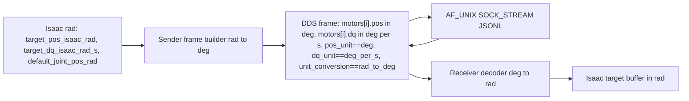

# Final Virtual DDS Gate over UDS/JSONL Implementation Plan

> **For agentic workers:** REQUIRED SUB-SKILL: Use superpowers:subagent-driven-development (recommended) or superpowers:executing-plans to implement this plan task-by-task. Steps use checkbox (`- [ ]`) syntax for tracking.

**Goal:** 在 `validation/final-virtual-dds-gate` 分支上，以与真实电机完全相同字段语义（`timestamp_ns / sequence_id / motor_count / motors[i].{pos, dq, kp, kd, tau}`，**绝对位置**，**无 delta 字段**，wire 单位 = `deg / deg_per_s / Nm`）的 sandbox frame，跑通并锁定**两个、且仅两个**最终闸门测试：(1) 单关节绝对位置控制闸门覆盖 motor_id 1..22；(2) `model_9999.pt` 在默认姿态机器人上推理后经 `policy → clipped → target_pos_isaac_rad → joint_name → motor_id → sign adapter → rad→deg → virtual DDS frame → sandbox receiver → deg→rad → Isaac target buffer → sim_step` 单一控制链路闭环，确认推理与运动正常。

**Architecture:** Final Virtual DDS Gate **over UDS / JSONL**。双终端、in-process + AF_UNIX SOCK_STREAM 两套虚拟传输。sender 端把 Isaac joint 目标 (rad) → joint_name → motor_id → sign adapter → rad→deg → 22 槽绝对位置 motor command frame；receiver 端做 deg→rad、sign 解码、target buffer 直写。schema / transport / sign / unit 全部 pure-Python，禁止任何 cyclonedds / fastdds / vendor SDK / 真 LowCmd / Domain 0。

**Tech Stack:** Python 3.11, `tomllib`, `dataclasses`, `math.radians/degrees`, AF_UNIX SOCK_STREAM + JSONL, pytest, Isaac Lab `G0-Velocity-v0`, rsl_rl `OnPolicyRunner` 推理路径，`logs/rsl_rl/g0_velocity/2026-05-14_18-29-19/model_9999.pt` (sha256 锁定 `1dc0c434a4b991eaaa435a21b9d4265e0267eb781b69b132bd75a0b5883928cd`)。

---

## A. 修订说明（v2.1 相对 v1 的整改 + v2.0 之上的小修）

本版（v2.1）相对第一版（v1）做了以下整改，**第一版正确的部分全部保留**；v2.0 → v2.1 的小修在条目 11、12（用户第二轮反馈），下面是全部条目：

1. **阶段名改名为 "Final Virtual DDS Gate over UDS/JSONL"**。v1 模糊地称之为 "sandbox DDS frame"，容易被误读为"已经在真实 DDS middleware 上跑"。v2 全文显式区分：本闸门不是 Real DDS middleware sandbox（详见 §C）。
2. **wire 单位从 `rad / rad_per_s` 改为 `deg / deg_per_s`**，与真机 `MotorControl::Control` 字段语义对齐；新增 `tau_unit = "Nm"` 元字段；rad↔deg 转换边界明确画在 sender / receiver 两侧（详见 §F / §G）。
3. **新增 motors[i].motor_id == i + 1 contract**（§E）和 lookup helper：`lookup(motor_id=k)` 在 Python 实现里必须访问 `motors[k - 1]`，禁止 0/1 base 混用。
4. **sign adapter 新增 visual direction 维度**：sandwich 一致性是必要但不充分；Test 1 必须在 Isaac 视角上独立观察 actual_q 旋转方向是否符合右手定则期望（详见 §H / §I）。
5. **Test 2 控制链统一为单一路径**：Isaac Lab 原始 action manager 被显式绕过，所有 target buffer 写入只来源于 DDS receiver；step 用 `base_env.sim.step()` + `base_env.scene.update(dt)` 手工节拍，policy obs 通过 `observation_manager.compute()` 直接拿。（详见 §J）
6. **Stale / sequence_id 单调 / timestamp 单调 / max_cmd_age / NaN/Inf / motor_count != 22 / 缺失三 True flag 等最小安全闸门，全部保留**。v1 把这些视为"旧通用测试不迁移"，v2 改为：旧测试文件确实不迁移，但新 runner 和新 contract tests 必须 inline 覆盖这些行为（详见 §L / §N）。
7. **Test 1 全文去除任何 "delta command / send delta / +delta / -delta" 表述**。允许出现的术语只有：`hold_pos / target_pos_1 / target_pos_2 / generated_test_offset_rad`，且 `generated_test_offset_rad` 仅用于日志，DDS frame 字段里不存在（详见 §I）。
8. **JSONL 同时记录 rad 与 deg 两套数值**，以及 `unit_conversion = "rad_to_deg"` / `pos_unit = "deg"` / `dq_unit = "deg_per_s"` / `tau_unit = "Nm"`（详见 §K）。
9. **tests 清单整体重写，并加入 §L 显式列出的 unit / deployment / isaac release-gate 三类必备测试**。
10. **§O 真机前 checklist 补强**：明确本闸门只能进入 "real hardware read-only / low-gain single-joint test 准备阶段"，不能直接进入真实 policy control；`real_readonly_confirmed=false / real_sign_zero_confirmed=false` 在 mapping loader 层做硬闸。
11. **(v2.1)** **forbidden field 名单收紧到完整 token，不再禁止裸 `q / dq / pos / delta`**：原 v2 的禁止列表 `target_q / delta / enable / q / dq_rad / pos_rad / offset_*` 会误伤合法 wire 字段 `dq` 与 JSONL 字段 `delta_actual_q`；v2.1 改为只禁止 `target_q / target_dq / delta_command / send_delta / enable_motor / pos_rad_on_wire / dq_rad_on_wire / offset_<suffix>` 这一组完整 token。详见 §D 禁止字段段 + §L L1 + Task 10 grep。
12. **(v2.1)** **Test 2 严格区分"必须复用" vs "允许绕过"**：v2 只说"绕过 action manager"，但没说"必须复用什么"。v2.1 在 §J 新增 "必须复用 vs 允许绕过 的明确边界" 小节，要求 policy loading / obs preprocessing / normalization / device handling 严格走 `_rollout_core._load_policy + wrapped_env.get_observations` 同款 validated 路径；DDS receiver 是 target buffer 的唯一写入者。summary 强制追加 `policy_obs_pipeline_reused / policy_loader / obs_source / clip_actions / action_scale / device / target_buffer_writers` 七个字段。详见 §J 新增小节 / §K Test 2 summary 模板 / §M Test 2 PASS 条件 9-10 / §N stop condition 7。

文件结构 / 安全边界 / mapping 表 / motor_id 双射 / `validation/final-virtual-dds-gate` 分支起点 / `model_9999.pt` sha256 / `_hardware_unlock.py` 4 把锁，**与 v1 保持一致**。

---

## B. 最终阶段名称：Final Virtual DDS Gate over UDS/JSONL

正式名称：**Final Virtual DDS Gate over UDS/JSONL**（缩写：FVDG-UDS）。

阶段定位：

- 这是 **G0 上真实电机前的最后一次纯仿真闸门**。
- **传输层**：AF_UNIX SOCK_STREAM + JSONL（loopback only），加 in-process channel 作为单进程 fallback。
- **帧语义**：与真机 motor command frame 字段一一对应（`timestamp_ns / sequence_id / motor_count / motors[i].{pos, dq, kp, kd, tau}`），但承载在 sandbox 通道上。
- **不依赖任何真实 DDS middleware**（详见 §C）。

通过本闸门 = 证明 "G0 自家 motor_id mapping + Isaac visual sign + 绝对位置 frame schema + rad↔deg 单位转换 + sender/receiver 双终端契约 + policy 推理走完整链路" 在仿真层自洽。

通过本闸门 ≠ 证明真机硬件正确。下游进入"真实硬件 read-only / 低增益单关节测试"准备阶段时，仍须满足 §O 全部前置条件。

---

## C. 明确：本 plan 不是 Real DDS middleware sandbox

| 维度 | Final Virtual DDS Gate over UDS/JSONL（本 plan） | Real DDS middleware sandbox（未来工作，**不在**本 plan） |
|---|---|---|
| 中间件 | pure Python，无任何 DDS 实现 | CycloneDDS / FastDDS / vendor DDS |
| IDL | 自定义 Python dataclass + JSONL | 真实 G0 vendor IDL |
| Transport | AF_UNIX SOCK_STREAM (loopback)；in-process | UDP multicast / vendor 拓扑 |
| Domain | 无 DDS domain 概念；socket 路径作 namespace | Domain ID (禁止 0，例如 230) + topic 前缀 |
| Topic | 无 topic；JSONL 直送 | `rt/lowcmd_sandbox / rt/lowstate_sandbox` 类 |
| Vendor SDK | **绝对不引入** | 未来才接入 |
| 真 LowCmd / motor_command 路径 | **绝对不触达** | 仍需经过隔离闸门 |
| `real_readonly_confirmed` | 强制 false | 视真机 read-only confirmation 结果再翻转 |
| `real_sign_zero_confirmed` | 强制 false | 视真机 sign/zero 校准结果再翻转 |

**本闸门负责验证**：

1. final motor command frame schema 不变量（字段、单位、三 True flag、motor_count、motor_id == i+1）
2. motor_id ↔ joint_name mapping
3. sign adapter（Isaac visual sign 维度）
4. rad↔deg 单位转换
5. virtual DDS sender / receiver 双终端契约（UDS JSONL）
6. Isaac target buffer receiver 写入正确性
7. policy 推理经 DDS frame 化后仍能正常驱动 Isaac robot

**本闸门不负责验证**：

1. CycloneDDS / FastDDS 行为
2. vendor DDS middleware
3. 真 G0 vendor IDL 字节对齐
4. 真实 topic 路由
5. 真实 domain 隔离
6. 真实 LowCmd transport
7. 真实机器人 hardware

**重要声明（写入 [docs/dds_final_virtual_gate_release.md](docs/dds_final_virtual_gate_release.md) 头部）**：

> 本分支通过后，仅允许进入 "real hardware read-only / low-gain single-joint test" **准备阶段**，**不允许**直接进入真实 policy control，也**不允许**复用本分支代码当作真实 DDS middleware 实现。

---

## D. 正确的 motor command frame schema

唯一 frame 数据类（[scripts/validation/_dds_schema.py](scripts/validation/_dds_schema.py)）：

```python
SCHEMA_VERSION = 2
MOTOR_COUNT = 22

@dataclass(frozen=True)
class DdsMotorCommand:
    motor_id: int          # 1..22, 必须 == 父 frame motors[i] 的 (i + 1)
    pos: float             # wire 单位 = deg
    dq: float              # wire 单位 = deg/s
    kp: float              # 无量纲
    kd: float              # 无量纲
    tau: float             # 单位 = Nm (feed-forward 力矩)

@dataclass(frozen=True)
class DdsMotorCommandFrame:
    schema_version: int    # == 2
    timestamp_ns: int      # 单调递增，纳秒；epoch 不限定（虚拟通道允许虚拟时钟）
    sequence_id: int       # 单调递增，uint16-friendly
    motor_count: int       # == 22
    motors: tuple[DdsMotorCommand, ...]  # len == 22; motors[i].motor_id == i + 1
    source: str            # 例如 "final_single_joint_sender" / "final_policy_sender"
    virtual_only: bool     # == True
    dry_run: bool          # == True
    sandbox: bool          # == True
    pos_unit: str          # == "deg"
    dq_unit: str           # == "deg_per_s"
    tau_unit: str          # == "Nm"
    unit_conversion: str   # == "rad_to_deg"  (说明 sender 已经做完 rad→deg)
```

**构造期不变量（任一违反必须 raise）**：

- `schema_version == 2`
- `motor_count == 22`
- `len(motors) == 22`
- 对任意 `i in 0..21`，`motors[i].motor_id == i + 1`
- 22 个 `motor_id` 形成 1..22 的双射（无重复、无缺失、无越界）
- `virtual_only is True` / `dry_run is True` / `sandbox is True`（三 True 检查，**不接受 truthy non-True**）
- `pos_unit == "deg"` / `dq_unit == "deg_per_s"` / `tau_unit == "Nm"` / `unit_conversion == "rad_to_deg"`
- 所有 `pos / dq / kp / kd / tau`：`math.isfinite(...)` 为 True，禁止 NaN / Inf
- `sequence_id >= 0`、`timestamp_ns >= 0`

**显式禁止字段名**（模块文本 grep 必须为空；**只针对这一组完整 token**，**不**禁止裸 `q` / 裸 `dq` / 裸 `pos` / 裸 `delta` —— 因为 `dq` 是合法 wire 字段，`delta_actual_q` 是合法 JSONL 字段名）：

- `target_q`
- `target_dq`
- `delta_command`
- `send_delta`
- `enable_motor`
- `pos_rad_on_wire`
- `dq_rad_on_wire`
- `offset_*`（以 `offset_` 为前缀的任意字段名，不影响 `generated_test_offset_rad` 这个 JSONL 字段——该字段名包含 `offset_` 但**不以** `offset_` 起首，允许保留）

**JSON 序列化**：`json.dumps(frame.to_dict(), sort_keys=True)` 单行 JSONL，键顺序固定；`from_dict` 严格 schema 校验。

---

## E. `motors[i].motor_id == i + 1` Contract

**项目固定约定**（必须写进 [scripts/validation/_dds_schema.py](scripts/validation/_dds_schema.py) 模块 docstring 与 [docs/dds_motor_id_mapping_audit.md](docs/dds_motor_id_mapping_audit.md)）：

- **motor_id 是 1..22**（物理编号，1-indexed）
- **Python / JSON / tuple 中的 motors array index 是 0..21**（0-indexed）
- **motor_array_index = motor_id - 1**
- **motors[0].motor_id == 1**
- **motors[1].motor_id == 2**
- ...
- **motors[21].motor_id == 22**
- **对任意 i ∈ 0..21，必须有 `motors[i].motor_id == i + 1`**
- **lookup motor_id k 时必须访问 `motors[k - 1]`**

**lookup helper（[scripts/validation/_dds_schema.py](scripts/validation/_dds_schema.py)）**：

```python
def get_motor(frame: DdsMotorCommandFrame, motor_id: int) -> DdsMotorCommand:
    if not 1 <= motor_id <= 22:
        raise ValueError(f"motor_id must be in 1..22, got {motor_id}")
    motor = frame.motors[motor_id - 1]
    if motor.motor_id != motor_id:
        raise ValueError(
            f"motors[{motor_id - 1}].motor_id == {motor.motor_id}, expected {motor_id}; "
            "schema invariant motors[i].motor_id == i + 1 violated"
        )
    return motor
```

**Contract tests**（[tests/unit/test_dds_schema_contract.py](tests/unit/test_dds_schema_contract.py)）：

1. `len(frame.motors) == 22`
2. `frame.motors[0].motor_id == 1`
3. `frame.motors[21].motor_id == 22`
4. `get_motor(frame, k) is frame.motors[k - 1]` for all `k ∈ 1..22`
5. 构造时任一 `motors[i].motor_id != i + 1` → raise
6. 构造时存在重复 `motor_id` → raise
7. 构造时存在缺失 `motor_id`（22 行内出现 1..22 之外的值）→ raise
8. 构造时 `motor_id ∉ 1..22` → raise

**与 motion_planner 的差异警示**（写入 [docs/dds_motor_id_mapping_audit.md](docs/dds_motor_id_mapping_audit.md)）：

> motion_planner 真机 `motors[i].pos` 中 `i` 是 0-indexed 纯数组下标，**不**等于我们的 1-indexed motor_id。
> Final Virtual DDS Gate over UDS/JSONL **不向 motion_planner 兼容**；本表是 G0 自家的 sandbox 语义，未来接入真实 vendor IDL 时由 vendor 适配层完成 motor_id (1..22) ↔ vendor array index 翻译，不在本 plan 范围。

---

## F. degree / degree_s wire 单位设计

**wire 单位最终决策**：

- `motors[i].pos` 单位 = **deg**
- `motors[i].dq` 单位 = **deg/s**
- `motors[i].kp` 单位 = 无量纲（数值与真机一致即可）
- `motors[i].kd` 单位 = 无量纲
- `motors[i].tau` 单位 = **Nm**

理由：

1. 与真机 `MotorControl::Control` 字段语义对齐（参见 [docs/motion_planner_dds_review_for_phase_4_5.md](docs/motion_planner_dds_review_for_phase_4_5.md) §2.2 `motors[i].pos = deg`）。
2. 这是"上真实电机前的最后一次虚拟闸门"，wire 单位若不对齐真机会让 sender / receiver / JSONL audit / 真机适配三处都积累歧义，未来切换到真实 vendor IDL 时容易出 unit bug。
3. Isaac native 单位是 rad，因此**只在 sender 和 receiver 两端做单位转换**；wire 上全是 deg。

**双层单位定义**：

| 层 | pos | dq | tau |
|---|---|---|---|
| Isaac internal | rad | rad/s | Nm |
| Virtual DDS wire | **deg** | **deg/s** | Nm |
| Sender 端转换 | rad → deg | rad/s → deg/s | (Nm 不变) |
| Receiver 端转换 | deg → rad | deg/s → rad/s | (Nm 不变) |
| JSONL 同时记录 | `target_pos_isaac_rad` 与 `target_pos_wire_deg` | `target_dq_isaac_rad_s` 与 `target_dq_wire_deg_s` | `tau_ff_Nm` |

**Schema 元字段**：

```python
pos_unit = "deg"
dq_unit  = "deg_per_s"
tau_unit = "Nm"
unit_conversion = "rad_to_deg"
```

**转换工具**（[scripts/validation/_units.py](scripts/validation/_units.py)，新增独立模块）：

- `rad_to_deg(value_rad: float) -> float` ≡ `math.degrees(value_rad)`
- `deg_to_rad(value_deg: float) -> float` ≡ `math.radians(value_deg)`
- `rad_s_to_deg_s(value: float) -> float`
- `deg_s_to_rad_s(value: float) -> float`
- 所有函数：输入若非 finite → raise `ValueError`

---

## G. rad ↔ deg conversion boundary

**单一规范**：



**契约**：

1. **sender 端**：所有从 Isaac 出来的目标在 frame builder 之前都是 rad。`build_*_frame(...)` **入参全部 rad**，函数内部做 `rad_to_deg(...)` 并写入 `motors[i].pos / dq`。
2. **wire frame**：`motors[i].pos / dq` 全是 deg；`pos_unit / dq_unit / unit_conversion` 元字段必须自描述。
3. **receiver 端**：拿到 frame 后，第一步检查 `pos_unit == "deg"` 和 `unit_conversion == "rad_to_deg"`，否则 `record_reject(reason="unit_mismatch")`；通过后用 `deg_to_rad(motors[i].pos)` 还原成 rad，再经 `sign_from_wire(joint, rad)` 还原 sign，最后写 `robot.set_joint_position_target(...)`。
4. **JSONL** 每一行同时记录 `target_pos_isaac_rad / target_pos_wire_deg / target_dq_isaac_rad_s / target_dq_wire_deg_s / unit_conversion / pos_unit / dq_unit / tau_unit`（详见 §K）。
5. **未来真实 vendor SDK 接入边界**：vendor adapter 层（**本 plan 不实现**）只允许从 `pos_unit == "deg"` / `dq_unit == "deg_per_s"` 的 frame 读取数值后直接喂给 vendor IDL；任何"读出来是 rad 然后再转一次 deg" 的二次转换路径都是 bug。
6. **禁止**：sender 直接构造 deg 而绕过 `rad_to_deg(...)`；receiver 直接读 `motors[i].pos` 当作 rad 写 Isaac；任何 frame 把 `pos_unit / dq_unit / unit_conversion` 设成 deg 之外的字面值（schema 强制 raise）。

**roundtrip contract tests**（[tests/unit/test_units_contract.py](tests/unit/test_units_contract.py)）：

- 对 `value_rad ∈ {-π, -π/4, -0.5, -0.1, 0.0, 0.1, 0.5, π/4, π}`，`deg_to_rad(rad_to_deg(v)) == v`（绝对误差 ≤ 1e-12）
- `rad_to_deg(0.5)` 与 `math.degrees(0.5)` 相等
- `rad_to_deg(NaN)` / `rad_to_deg(Inf)` raise
- `deg_to_rad(NaN)` / `deg_to_rad(Inf)` raise
- 22 维 Isaac default standing pose `G0_DEFAULT_JOINT_POS`，经过 sender `rad_to_deg`（+ sign_to_wire）→ receiver `deg_to_rad`（+ sign_from_wire）→ 还原值与原值逐 joint 误差 ≤ 1e-9 rad

---

## H. Sign Adapter 设计与 Visual Direction 检查

**sign adapter 数据源**：[config/g0_motor_id_mapping.toml](config/g0_motor_id_mapping.toml) 每行 `sim_sign_observed ∈ {-1, +1}`（用户口径 22 行表，详见 §I 与 Task 2）。

**API**（[scripts/validation/_sign_adapter.py](scripts/validation/_sign_adapter.py)）：

```python
@dataclass(frozen=True)
class SignAdapter:
    signs_by_motor_id: Mapping[int, int]    # 1..22 -> ±1
    signs_by_joint_name: Mapping[str, int]  # isaac joint name -> ±1

def build_sign_adapter(mapping) -> SignAdapter: ...
def sign_to_wire(adapter, joint_name, isaac_value_rad: float) -> float:
    return adapter.signs_by_joint_name[joint_name] * isaac_value_rad
def sign_from_wire(adapter, joint_name, wire_value_rad: float) -> float:
    return adapter.signs_by_joint_name[joint_name] * wire_value_rad
```

注意：sign adapter 只乘 ±1，不做 rad↔deg。`sign_to_wire(...)` 的输入输出**仍是 rad**；`rad_to_deg` 紧接其后由 frame builder 做。

**Sandwich 一致性测试（必要但不充分）**：

- 对 22 个 joint、5 个测试值 `{-1.0, -0.5, 0.0, 0.5, 1.0}`，`sign_from_wire(adapter, joint, sign_to_wire(adapter, joint, v)) == v` 恒成立。
- `signs_by_motor_id` 与 query 给出的 22 行表完全一致（见 §I "Isaac visual sign 表"）。
- 所有 sign ∈ {-1, +1}，没有 0。

**Sandwich 一致性的局限性**（必须显式记录）：

> 即便 sign 表整体错了（例如所有 joint 都把 sign 反了），sandwich 检验仍会通过，因为 sender 和 receiver 共用同一张错表，两次 ±1 相乘会抵消。
> 因此 sandwich consistency **只能证明 sender 和 receiver 的 sign 表是一致的**，**不能证明 sign 表本身与 robot 物理 +X / 右手定则相符**。

**Visual direction 维度（Test 1 必备）**：

Test 1 在 Isaac receiver 中，对每个 motor_id 做"绝对位置目标 vs Isaac 视觉旋转方向"的独立断言：

- 取 `hold_pos_isaac_rad = G0_DEFAULT_JOINT_POS[joint]`
- 选定 `target_pos_isaac_rad = hold_pos_isaac_rad + offset`（offset ∈ {+0.5, -0.5}）
- 经 sign_to_wire + rad_to_deg → frame → bridge → deg_to_rad + sign_from_wire → 写 Isaac target buffer
- 30 步 sim_step 后取 `actual_q_after`
- **expected_right_hand_rule_direction = sign(offset)**（在 Isaac 视角下，由于 sender / receiver sign 互相抵消，Isaac actual_q 应该朝同侧偏移）
- **actual_visual_direction = sign(actual_q_after[joint] - hold_pos_isaac_rad)**
- **direction_passed = (expected == actual)**

如果某个 motor 的 sign 表是错的，**sandwich 仍会过**（因为我们用同一张表），但**视觉旋转方向也仍会与 offset 同侧**（因为 sender/receiver 抵消）。所以严格说视觉一致性只能验证：

(a) motor_id → joint_name 路由正确；
(b) sign adapter sender / receiver 一致；
(c) rad↔deg 单位转换没有破坏方向（不会因为单位换算反号）。

**关于真实 sign 正确性的边界声明**（写入 summary JSON、JSONL、release doc）：

> Test 1 validates Isaac visual sign adapter consistency only.
> Test 1 does **not** set real_sign_zero_confirmed = true.
> Test 1 does **not** prove real hardware sign / zero correctness.
> real_readonly_confirmed must remain false.
> real_sign_zero_confirmed must remain false.

`config/g0_motor_id_mapping.toml` loader 强制：任意行 `real_readonly_confirmed=true` 或 `real_sign_zero_confirmed=true` → raise（防人工手抖翻 flag）。

---

## I. Test 1 完整设计 —— Final Virtual DDS Single-Motor Absolute Position Command Gate

**目标**：用与真机相同语义的 motor command frame，逐一控制 motor_id 1..22。**每帧都是完整 22 槽 frame**；只改变目标 motor 的 `motors[motor_id - 1].pos`（绝对位置），其余 21 槽保持 default standing pose 经 sign + rad→deg 后的 `hold_pos_wire_deg`。**DDS frame 中没有 delta 字段；真正发送的是 `motors[i].pos`**。

**Runner**：[scripts/validation/run_final_virtual_dds_single_joint_gate.py](scripts/validation/run_final_virtual_dds_single_joint_gate.py)

### Modes

#### Mode `sender`（不需要 Isaac）

入参：

- `--motor-id <int>`（1..22）
- `--target-pos-isaac-rad <float>` (绝对位置目标，Isaac rad)
- `--sequence-start <int>`
- `--socket-path <path>`
- `--log <jsonl path>`
- `--emit-json <summary json path>`
- `--max-cmd-age-s 0.5`（写入 frame，receiver 用）

流程：

1. `assert_hardware_locked_for_rehearsal()`
2. 读取 `config/g0_motor_id_mapping.toml`，构造 `sign_adapter`
3. 查出 `joint_name = lookup_by_motor_id(mapping, motor_id).isaac_joint_name`
4. `hold_pos_isaac_rad = G0_DEFAULT_JOINT_POS[joint_name]`
5. `target_pos_isaac_rad = args.target_pos_isaac_rad`（绝对位置）
6. `generated_test_offset_rad = target_pos_isaac_rad - hold_pos_isaac_rad`（**仅用于日志**，不进 DDS frame）
7. `base_frame = build_hold_frame(G0_DEFAULT_JOINT_POS, mapping, sign_adapter, kp_by_joint, kd_by_joint, sequence_id=N, timestamp_ns=now_ns, source="final_single_joint_sender")`：22 槽全部填 `pos = rad_to_deg(sign_to_wire(joint_i, default[joint_i]))`、`dq=0.0`、`tau=0.0`、`kp/kd` 按表
8. `frame = build_single_motor_frame(base_frame, motor_id=motor_id, target_pos_isaac_rad=target_pos_isaac_rad, sequence_id=N+1, timestamp_ns=now_ns+1)`：在 base_frame 之上把 `motors[motor_id - 1].pos` 替换为 `rad_to_deg(sign_to_wire(joint_name, target_pos_isaac_rad))`；其余 21 槽保持
9. `send_frame_to_bridge(frame, socket_path=...)` → ack `{delivered:1, sequence_id:N+1}`
10. recorder 追加 `dds_command` + `dds_sign_audit` 事件（含 `generated_test_offset_rad`、`target_pos_isaac_rad`、`target_pos_wire_deg`、`sim_sign_observed`、`real_sign_zero_confirmed=false`）
11. 写 JSONL（每包一行）+ summary JSON

#### Mode `isaac-receiver`（需要 Isaac Lab）

入参：

- `--task G0-Velocity-v0`
- `--headless true`
- `--socket-path /tmp/g0_dds_sandbox_final.sock`
- `--server-timeout-sec 600`
- `--max-packets 66`
- `--emit-json logs/validation/dds_final_single_joint_receiver.json`
- `--suspend-for-sign-audit / --float-height-for-sign-audit 1.0 / --disable-gravity-for-sign-audit`（沿用上一分支视觉悬浮姿态做法）
- `--max-cmd-age-s 0.5`

流程：

1. `assert_hardware_locked_for_rehearsal()`，强制 `G0_ALLOW_HARDWARE=0`
2. `AppLauncher({"headless": True}).app`
3. 构造 `G0RobotLabEnvCfg` + 单 env + 默认 standing pose + 关闭随机化
4. `env.reset()`，capture `joint_names_isaac` 与 `joint_name_to_index`，capture `hold_pos_isaac_rad_by_joint = G0_DEFAULT_JOINT_POS`
5. 启动 `VirtualDdsSandboxBridge.serve_forever(handler, timeout_sec=...)`
6. 对每个收到的 frame 执行：
   1. **schema flag 校验**：`frame.virtual_only and frame.dry_run and frame.sandbox` 三 True，否则 record_reject `missing_flag`
   2. **schema 形状校验**：`motor_count == 22`、`len(motors) == 22`、`motors[i].motor_id == i + 1`
   3. **unit 校验**：`pos_unit == "deg"` / `dq_unit == "deg_per_s"` / `tau_unit == "Nm"` / `unit_conversion == "rad_to_deg"`
   4. **sequence_id 单调**：`current.sequence_id > last.sequence_id` 否则 record_reject `non_monotonic_sequence_id`
   5. **timestamp_ns 单调**：`current.timestamp_ns > last.timestamp_ns` 否则 record_reject `non_monotonic_timestamp_ns`
   6. **stale 校验**：`(now_ns - frame.timestamp_ns) / 1e9 <= max_cmd_age_s` 否则 record_reject `stale_command`
   7. **NaN / Inf 校验**：对每槽 pos/dq/kp/kd/tau `math.isfinite` 否则 record_reject `nan_or_inf`
   8. **single-joint 不变量**：与一份"hold_frame_wire_deg" 比较，**恰好一槽**的 `pos` 偏离 hold 值 > 1e-6 deg；否则 record_reject `single_joint_required`
   9. 该槽 `motor_id = i + 1` → mapping → `expected_joint_name`
   10. 解码：`target_pos_isaac_rad = sign_from_wire(joint_name=expected_joint_name, deg_to_rad(motors[i].pos))`
   11. clone `default_joint_pos`，仅 `joint_name_to_index[expected_joint_name]` 槽置 `target_pos_isaac_rad`
   12. `robot.set_joint_position_target(joint_targets)`；`base_env.scene.write_data_to_sim()`
   13. 记录 `actual_q_before`；走 30 个 `base_env.sim.step()` + `base_env.scene.update(dt)`
   14. 记录 `actual_q_after`
   15. **Layer 1 校验（target buffer writes）**：target buffer 中实际被改动的 joint 集合 == `{expected_joint_name}`
   16. **Layer 2 校验（motion）**：`|actual_q_after[expected] - actual_q_before[expected]| >= motion_epsilon=0.02 rad`，且所有非 expected joint 的 `|Δq| < idle_epsilon=0.01 rad`
   17. **Layer 3 校验（visual direction）**：`sign(actual_q_after[expected] - hold_pos_isaac_rad[expected]) == sign(target_pos_isaac_rad - hold_pos_isaac_rad[expected])`（Isaac 视觉旋转方向与目标偏移方向一致）
7. 输出：每包一行 JSONL 到 `logs/validation/dds_final_single_joint_<motor_id>.jsonl`；最终 summary JSON 到 `logs/validation/dds_final_single_joint_summary.json`

#### Mode `sweep`（驱动 motor_id 1..22 全量）

- 对每个 motor_id 触发 `sender` 三次：
  - hold_pos（绝对位置 = default）回归基线
  - target_pos_1 = `default + 0.5 rad`（正方向绝对位置）
  - target_pos_2 = `default - 0.5 rad`（负方向绝对位置）
- 中间穿插 hold_pos 归位
- 总计 22 × 3 = 66 帧
- 如关节软限位接近 `default ± 0.5 rad`，自动降为 `± 0.3 rad`（不超过 `pos_lower/upper` 的 90%），并在 JSONL 中标 `clipped_for_limit=true`
- 注意：**所有方向测试都是绝对目标位置 target_pos_*，不是 delta**

### 通过门槛

- 22 个 motor_id × 2 个方向（正/负绝对目标）都通过 Layer 1 / Layer 2 / Layer 3
- 全部 frame `virtual_only / dry_run / sandbox` 三 True
- 全部 frame `pos_unit == "deg" / dq_unit == "deg_per_s" / tau_unit == "Nm" / unit_conversion == "rad_to_deg"`
- 全部 frame `motors[i].motor_id == i + 1`
- `pass_count == 22 × 2 == 44` 且 `fail_count == 0`
- 无 `cyclonedds / fastdds / unitree / ethercat / serial / lowcmd / domain 0` 等 forbidden token
- summary 写入：
  - `mapping_hardware_id_confirmed_count == 0 (or 22 if user toggled, doesn't gate)`
  - `real_readonly_confirmed_count == 0`
  - `real_sign_zero_confirmed_count == 0`

### sim_sign_observed 期望表（与 query 给出的 22 行完全一致）

| motor_id | joint_name | sim_sign_observed |
|---|---|---|
| 1 | waist_yaw_joint | -1 |
| 2 | waist_roll_joint | -1 |
| 3 | l_shoulder_pitch_joint | -1 |
| 4 | l_shoulder_roll_joint | -1 |
| 5 | l_shoulder_yaw_joint | -1 |
| 6 | l_elbow_pitch_joint | -1 |
| 7 | r_shoulder_pitch_joint | +1 |
| 8 | r_shoulder_roll_joint | -1 |
| 9 | r_shoulder_yaw_joint | -1 |
| 10 | r_elbow_pitch_joint | +1 |
| 11 | l_hip_pitch_joint | +1 |
| 12 | l_hip_roll_joint | -1 |
| 13 | l_hip_yaw_joint | -1 |
| 14 | l_knee_pitch_joint | -1 |
| 15 | l_ankle_pitch_joint | -1 |
| 16 | l_ankle_roll_joint | -1 |
| 17 | r_hip_pitch_joint | -1 |
| 18 | r_hip_roll_joint | -1 |
| 19 | r_hip_yaw_joint | -1 |
| 20 | r_knee_pitch_joint | +1 |
| 21 | r_ankle_pitch_joint | +1 |
| 22 | r_ankle_roll_joint | -1 |

---

## J. Test 2 完整设计 —— Final Virtual DDS Policy Inference Gate（单一控制链路）

**目标**：默认姿态机器人上跑 `model_9999.pt`，policy 输出经下面这条**唯一控制链路**驱动 Isaac，确认推理与运动闭环正常：

```mermaid
flowchart LR
    Obs["observation_manager.compute()"]
    Policy["policy(obs) -> raw_action"]
    Clip["clip(-1, +1)"]
    Scale["target_pos_isaac_rad = default + action_scale * clipped"]
    JName["per-action-index -> joint_name"]
    MId["joint_name -> motor_id"]
    Sign["sign_to_wire(joint, value_rad)"]
    Unit["rad_to_deg"]
    Build["build_policy_frame(...)"]
    Bridge["UDS JSONL sandbox bridge"]
    Decode["receiver: schema/stale/seq/NaN check"]
    UnitBack["deg_to_rad"]
    SignBack["sign_from_wire"]
    Buf["robot.set_joint_position_target(...)"]
    Sim["base_env.sim.step() + base_env.scene.update(dt)"]
    Obs --> Policy --> Clip --> Scale --> JName --> MId --> Sign --> Unit --> Build --> Bridge --> Decode --> UnitBack --> SignBack --> Buf --> Sim --> Obs
```



### 关于双重控制问题的回答（明确实施方案）

| # | 问题 | 回答 |
|---|---|---|
| 1 | 是否完全绕过 Isaac Lab 原始 action manager？ | **是**。Test 2 不调用 `env.step(action)`；只调用 `base_env.sim.step()` + `base_env.scene.update(dt)` 手工节拍。 |
| 2 | 如果绕过，policy action 如何转换为 target joint pos？ | `target_pos_isaac_rad[joint] = G0_DEFAULT_JOINT_POS[joint] + action_scale * clipped[action_index_for_joint]`；action_index→joint_name 顺序取自 `velocity_env_cfg` 的 action term joint_names。 |
| 3 | action_scale 是否与训练时一致？ | **是**。`action_scale = 0.12`（与训练 `JointPositionAction.scale=0.12` 一致；具体值从 `velocity_env_cfg.actions.joint_pos` 取，**不**硬编码）。 |
| 4 | default_joint_pos 是否与训练环境一致？ | **是**。从 `G0_DEFAULT_JOINT_POS`（[source/g0_robot_lab/g0_robot_lab/assets/robots/g0/g0.py](source/g0_robot_lab/g0_robot_lab/assets/robots/g0/g0.py)）读，与训练一致。 |
| 5 | receiver 写 target buffer 时，env.step 是否传 zero action？ | **不调用 env.step**。整个 Test 2 不让 action manager 参与控制；任何 zero / non-zero action 都不传给 action manager。 |
| 6 | zero action 是否会覆盖 receiver 写入的 target buffer？ | 不会，因为根本不调用 action manager。 |
| 7 | 如果会冲突，应该改成怎样的 step 顺序？ | 见下方 "单 tick 顺序"。 |
| 8 | 最终到底是谁写入 Isaac target buffer？ | **只有 DDS receiver** 通过 `robot.set_joint_position_target(joint_targets); base_env.scene.write_data_to_sim()` 写入。**唯一写入者**。 |
| 9 | 这个测试是 open-loop replay 还是 closed-loop？ | **closed-loop**：obs 取自当前 sim 状态（已被 receiver 控制过），policy 在其上推理产生下一帧 action。 |
| 10 | obs 是否来自 receiver 驱动后的 Isaac robot？ | **是**。obs 直接从 `base_env.observation_manager.compute()` 取，反映的是上一次 sim_step 后机器人的真实状态。 |

### 必须复用 vs 允许绕过 的明确边界

Test 2 绕过的**只有**最后一段 "action → action manager → JointPositionAction → target buffer" 的写入；其它一切 policy 推理上下游必须**严格复用** main 上 validated 的 `scripts/rsl_rl/play.py` / 上一分支 `scripts/validation/_rollout_core.py` 同款路径，否则 Test 2 会因为 obs 形状 / 归一化 / device 不匹配而 silently 跑出不可信结果。

**必须复用（不允许重写）**：

1. **Policy loading 路径**：用 `_rollout_core._load_policy(...)` 等价实现（`OnPolicyRunner / DistillationRunner` 二选一 + `cli_args.parse_rsl_rl_cfg(task, agent_args)` + `runner.load(str(checkpoint))` + `runner.get_inference_policy(device=...)`）；不允许另起一套 `torch.load` 自己手装 actor。
2. **Env / Cfg 构造**：用 `G0RobotLabEnvCfg()` + `apply_fixed_policy_rollout_env_cfg(env_cfg, num_envs=1, root_z=0.233)` + `gym.make(task, cfg=env_cfg)` + `RslRlVecEnvWrapper(env, clip_actions=agent_cfg.clip_actions)`；保持 `clip_actions` 与训练一致。
3. **Obs 计算路径**：obs 取 `wrapped_env.get_observations()` 的返回（与 `play.py` 一致），它会走 `base_env.observation_manager.compute()` + `RslRlVecEnvWrapper` 内部的 obs flatten / dict-to-tensor / device 迁移。`base_env.observation_manager.compute()` 仅作为兜底实现说明，**禁止**手工 reimplement obs concatenation / scaling / clip。
4. **Obs normalization / running mean / std**：若 policy 自带 `policy.reset()`，每次 `env.reset()` 必须同步调用；若 runner 内部维护了 `obs_normalizer` / `running mean std` / `RunningMeanStd`，必须通过 `runner.get_inference_policy(...)` 暴露出来的 inference policy 调用，**禁止**自己写归一化层。
5. **Device handling**：`agent_cfg.device` / `wrapped_env.unwrapped.device` / `env_cfg.sim.device` 三者保持一致；policy 输入 obs 与 raw_action 输出全部留在该 device；只有要写入 DDS frame 前才 `.detach().cpu().tolist()`。
6. **Action shape**：raw_action 形状 `[num_envs, action_dim] == [1, 22]`；不允许 squeeze 后丢 batch 维度，写 DDS frame 时显式 `[0, action_index_for_joint]` 取标量。
7. **clip_actions**：clip 区间取自 `agent_cfg.clip_actions`（与训练一致），**不**硬编码 `[-1, +1]`，除非该 cfg 字面就是 `1.0`。
8. **Action joint 顺序**：`action_index_for_joint` 映射取自 `velocity_env_cfg.actions.joint_pos` 的 `joint_names`（这是训练时 action term 的 joint 序），**不**硬编码 `G0_JOINT_NAMES`。

**允许（且必须）绕过**：

A. `env.step(action)` 全链路：因为它内部会 `action_manager.process_action(action)` → `JointPositionAction.apply_actions()` → 写 target buffer → `sim.step()` → `observation_manager.compute()`。这条链路里 **"action → target buffer"** 的最后一步必须被剥离。
B. `JointPositionAction.apply_actions()` 写入 `robot._data.joint_pos_target` 的那一刻：DDS receiver 必须在这一刻**之前**或**完全替代**地写入 target buffer。
C. 推荐实施：调用 `_load_policy` 后**不**调 `wrapped_env.step(...)`，自己手工节拍 `wrapped_env.get_observations()` → `policy(obs)` → DDS sender → DDS receiver → `robot.set_joint_position_target(...)` → `base_env.scene.write_data_to_sim()` → `base_env.sim.step(render=False)` → `base_env.scene.update(dt)`。下一轮 `wrapped_env.get_observations()` 自动反映新的 sim 状态。
D. 如果 `wrapped_env` 没有暴露 `get_observations()` 这条接口，回退到 `base_env.observation_manager.compute()` + `RslRlVecEnvWrapper._convert_observations_to_tensor(...)` 等价路径；但仍要走 wrapper 的 obs flatten，**不**绕过 wrapper。

**唯一 target buffer writer**：DDS receiver。任何在 §J 单 tick 顺序中**不来自** DDS receiver 的 `set_joint_position_target / write_data_to_sim / data.joint_pos_target[:] = ...` 都视为违反约定，contract test 必须捕获（grep 业务代码内不允许出现两次 `set_joint_position_target` 调用点，除 receiver_handler 之外）。

**Test 2 summary 中追加字段**（与 §K Test 2 summary 模板对齐）：

- `policy_obs_pipeline_reused: true`（必须 true，不为 true 直接 FAIL）
- `policy_loader: "_rollout_core._load_policy"`
- `obs_source: "wrapped_env.get_observations"`
- `clip_actions: <agent_cfg.clip_actions 实际值>`
- `action_scale: <env_cfg.actions.joint_pos.scale 实际值>`
- `device: <agent_cfg.device 实际值>`
- `action_manager_bypassed: true`
- `target_buffer_writers: ["dds_receiver_handler"]`（**长度必须为 1**，且字面值就是这个）

### 单 tick 顺序（必须按此顺序写在 runner 中）

每个 tick：

```
1. obs = base_env.observation_manager.compute()
2. raw_action = policy(obs)                    # ∈ ℝ^{1×22}
3. clipped = raw_action.clamp(-1, +1)
4. target_pos_isaac_rad_by_joint = {
       joint: G0_DEFAULT_JOINT_POS[joint] + action_scale * clipped[0, action_index_for_joint]
       for joint in g0_action_joint_order
   }
5. dq_isaac_rad_s_by_joint = {joint: 0.0 for joint in g0_action_joint_order}
6. frame = build_policy_frame(
       target_pos_isaac_rad_by_joint, dq_isaac_rad_s_by_joint,
       mapping, sign_adapter, kp_by_joint, kd_by_joint,
       sequence_id=N, timestamp_ns=now_ns, source="final_policy_sender",
   )
7. send_frame_to_bridge(frame)                # 跨 socket（或 in-process channel）
8. receiver_handler(frame):
   a. schema / unit / sequence / timestamp / stale / NaN 全部校验通过
   b. for each motors[i] (i=0..21):
        joint_name = motor_id_to_joint(motors[i].motor_id)
        target_isaac_rad = sign_from_wire(joint_name, deg_to_rad(motors[i].pos))
        joint_targets[batch_index, joint_name_to_index[joint_name]] = target_isaac_rad
   c. robot.set_joint_position_target(joint_targets)
   d. base_env.scene.write_data_to_sim()
9. base_env.sim.step(render=False)
10. base_env.scene.update(dt=base_env.physics_dt)
11. record telemetry (raw_action norm, root_z, joint_pos snapshot, termination flags)
```

**不允许的写法**：

- ❌ `env.step(raw_action)`（会让 action manager 写一次 target buffer）
- ❌ `env.step(zero_action)`（会让 action manager 写 default pose 一次 target buffer）
- ❌ 在 step 之间多次 `set_joint_position_target`（仅允许 receiver_handler 内**一次**写入）
- ❌ 在 in-process channel 模式下让 producer 和 consumer 同时跑两个线程并各自 `set_joint_position_target`（必须串行单线程）

### Modes

#### `headless-policy`（不启动 Isaac App，CI 友好）

- 入参：`--checkpoint <path>`、`--num-steps 10`、`--seed 42`、`--emit-json`
- 流程：
  1. `assert_hardware_locked_for_rehearsal()`
  2. 校验 checkpoint 默认 = `logs/rsl_rl/g0_velocity/2026-05-14_18-29-19/model_9999.pt`；sha256 == `1dc0c434a4b991eaaa435a21b9d4265e0267eb781b69b132bd75a0b5883928cd`
  3. 用 22 维 deterministic synthetic action（例如对 motor_id ∈ 1..22 做 `clipped[i] = sin(0.1 * i + step) ∈ [-1, +1]`）作为"伪 policy 输出"
  4. 走 §J 单 tick 顺序的第 3..9 步（跳过 obs 与真 policy；in-process channel；不启动 Isaac）
  5. 在 receiver 之后**取消 sim_step 和 Isaac**：直接断言 receiver_handler 解码出来的 22 维 `target_isaac_rad` 与 sender 端 input `target_pos_isaac_rad_by_joint` 完全一致（每 joint 误差 < 1e-9 rad）
  6. 跑 N=10 帧；sequence_id 单调；timestamp_ns 单调
- 通过门槛：
  - 22 维 reconstructed target == policy input target，每个 joint 误差 < 1e-9 rad
  - 10 帧 sequence_id 严格单调，timestamp_ns 严格单调
  - 全部 frame schema flag 三 True、unit 字段对、`motors[i].motor_id == i + 1`
  - checkpoint 文件存在 + sha256 命中 + `torch.load(map_location="cpu", weights_only=False)` 不抛异常

#### `isaac-policy`（`pytest.mark.isaaclab + pytest.mark.release_gate`，CI 默认 skip，手动 release-gate 执行）

- 入参：`--task G0-Velocity-v0`、`--checkpoint`、`--num-steps 500`、`--seed 42`、`--root-z 0.233`、`--socket-path /tmp/g0_dds_sandbox_final.sock`、`--emit-json`、`--device cuda:0`、`--headless True`、`--in-process` / `--uds`（默认 `--in-process` 单进程串行，可选 `--uds` 走真实 socket）
- 流程：
  1. `assert_hardware_locked_for_rehearsal()`，强制 `G0_ALLOW_HARDWARE=0`
  2. checkpoint sha256 校验
  3. `AppLauncher({"headless": True, "device": "cuda:0"}).app`
  4. 用复用的 `_load_policy(...)` 路径（OnPolicyRunner / DistillationRunner 二选一），加载 `model_9999.pt`；env 使用 `apply_fixed_policy_rollout_env_cfg(num_envs=1, root_z=0.233)`
  5. `env.reset()` 后**只调用 `base_env.observation_manager.compute()` + `base_env.sim.step()` + `base_env.scene.update(dt)` 串行**，**不**调用 `env.step(...)`
  6. 严格按 §J 单 tick 顺序跑 500 步；每 50 步快照 `root_z / joint_pos / termination flags`
  7. 通过门槛：
     - 推理路径未抛异常
     - `termination_count == 0`
     - `root_z ∈ [0.18, 0.35]`
     - 22 维 raw_action / clipped / target / wire / 反解 Isaac target 无 NaN / Inf
     - sequence_id 严格单调，dt_s 接近 `1 / policy_rate`
     - 全部 frame `virtual_only / dry_run / sandbox` 三 True
     - `pos_unit == "deg" / dq_unit == "deg_per_s" / tau_unit == "Nm" / unit_conversion == "rad_to_deg"`
- 输出：`logs/validation/dds_final_policy_inference_<timestamp>.json` summary + 每 tick `*.jsonl` trace

---

## K. JSONL 与 Summary JSON 字段

### 每帧 JSONL（[scripts/validation/_dds_recorder.py](scripts/validation/_dds_recorder.py)）

事件类型 ∈ {`dds_command`, `dds_reject`, `dds_sign_audit`, `dds_single_joint_result`, `dds_policy_step_result`}。所有事件**必须**包含 `transport / virtual_only / dry_run / sandbox / blocked / block_reason / emergency_stop / stale_command` 八个安全审计字段。

#### `dds_command`（每次发包 / 收包）

```json
{
  "event": "dds_command",
  "wall_time_ns": 1234567890,
  "sequence_id": 17,
  "source": "final_single_joint_sender",
  "virtual_only": true,
  "dry_run": true,
  "sandbox": true,
  "transport": "sandbox_uds_jsonl",
  "blocked": false,
  "block_reason": null,
  "emergency_stop": false,
  "stale_command": false,
  "frame": {
    "schema_version": 2,
    "motor_count": 22,
    "pos_unit": "deg",
    "dq_unit": "deg_per_s",
    "tau_unit": "Nm",
    "unit_conversion": "rad_to_deg",
    "motors_sha256": "<32-byte hex>"
  }
}
```

#### `dds_sign_audit`（Test 1，每帧每被改动 motor 一条）

```json
{
  "event": "dds_sign_audit",
  "motor_id": 3,
  "joint_name": "l_shoulder_pitch_joint",
  "sim_sign_observed": -1,
  "hold_pos_isaac_rad": -0.30,
  "target_pos_isaac_rad": 0.20,
  "generated_test_offset_rad": 0.50,
  "target_pos_wire_deg": 11.459155902616465,
  "target_dq_isaac_rad_s": 0.0,
  "target_dq_wire_deg_s": 0.0,
  "tau_ff_Nm": 0.0,
  "kp": 1.5,
  "kd": 0.06,
  "unit_conversion": "rad_to_deg",
  "pos_unit": "deg",
  "dq_unit": "deg_per_s",
  "tau_unit": "Nm",
  "real_readonly_confirmed": false,
  "real_sign_zero_confirmed": false
}
```

#### `dds_single_joint_result`（Test 1 receiver 侧每帧一条）

```json
{
  "event": "dds_single_joint_result",
  "motor_id": 3,
  "expected_joint_name": "l_shoulder_pitch_joint",
  "sim_sign_observed": -1,
  "hold_pos_isaac_rad": -0.30,
  "target_pos_isaac_rad": 0.20,
  "target_pos_wire_deg": 11.459155902616465,
  "receiver_applied_isaac_target_rad": 0.20,
  "expected_right_hand_rule_direction": 1,
  "actual_visual_direction": 1,
  "actual_q_before": -0.30,
  "actual_q_after": 0.19,
  "delta_actual_q": 0.49,
  "target_buffer_writes": 1,
  "wrong_joint_writes": [],
  "spurious_buffer_writes": [],
  "layer1_passed": true,
  "layer2_passed": true,
  "direction_passed": true,
  "real_readonly_confirmed": false,
  "real_sign_zero_confirmed": false
}
```

#### `dds_policy_step_result`（Test 2 每 tick 一条）

```json
{
  "event": "dds_policy_step_result",
  "step": 17,
  "sequence_id": 17,
  "raw_action_norm": 0.42,
  "clipped_action_norm": 0.42,
  "target_pos_isaac_rad_by_joint": {"l_hip_pitch_joint": -0.18, "...": "..."},
  "target_pos_wire_deg_by_joint": {"l_hip_pitch_joint": -10.30, "...": "..."},
  "receiver_applied_isaac_target_rad_by_joint": {"l_hip_pitch_joint": -0.18, "...": "..."},
  "root_z": 0.232,
  "termination_count": 0,
  "nan_count": 0,
  "inf_count": 0,
  "pos_unit": "deg",
  "dq_unit": "deg_per_s",
  "tau_unit": "Nm",
  "unit_conversion": "rad_to_deg"
}
```

#### `dds_reject`（任何被拒收的帧）

```json
{
  "event": "dds_reject",
  "sequence_id": 18,
  "wall_time_ns": 1234567899,
  "block_reason": "stale_command | non_monotonic_sequence_id | non_monotonic_timestamp_ns | nan_or_inf | unit_mismatch | missing_flag_virtual_only | missing_flag_dry_run | missing_flag_sandbox | motor_count_invalid | motor_id_mismatch | single_joint_required",
  "blocked": true,
  "emergency_stop": false,
  "stale_command": false,
  "transport": "sandbox_uds_jsonl"
}
```

### Summary JSON

#### Test 1 summary

```json
{
  "result": "PASS",
  "gate_name": "final_virtual_dds_gate_over_uds_jsonl_single_motor",
  "joint_count": 22,
  "directions_tested_per_motor": 2,
  "pass_count": 44,
  "fail_count": 0,
  "schema_version": 2,
  "transport": "sandbox_uds_jsonl",
  "pos_unit": "deg",
  "dq_unit": "deg_per_s",
  "tau_unit": "Nm",
  "unit_conversion": "rad_to_deg",
  "real_readonly_confirmed_count": 0,
  "real_sign_zero_confirmed_count": 0,
  "hardware_environment": {
    "G0_ALLOW_HARDWARE": "0",
    "G0_ALLOW_REAL_DDS": "0",
    "G0_ALLOW_REAL_LOWCMD": "0",
    "G0_DDS_VIRTUAL_ONLY": "1"
  },
  "notes": [
    "This validates Isaac visual sign adapter consistency only.",
    "This does NOT set real_sign_zero_confirmed=true.",
    "This does NOT prove real hardware sign / zero correctness."
  ],
  "per_motor": [
    {
      "motor_id": 1,
      "joint_name": "waist_yaw_joint",
      "sim_sign_observed": -1,
      "directions": [
        {"target_pos_isaac_rad": 0.5, "layer1_passed": true, "layer2_passed": true, "direction_passed": true},
        {"target_pos_isaac_rad": -0.5, "layer1_passed": true, "layer2_passed": true, "direction_passed": true}
      ]
    }
  ]
}
```

#### Test 2 summary

```json
{
  "result": "PASS",
  "gate_name": "final_virtual_dds_gate_over_uds_jsonl_policy_inference",
  "mode": "isaac-policy",
  "checkpoint": {
    "path": "logs/rsl_rl/g0_velocity/2026-05-14_18-29-19/model_9999.pt",
    "sha256": "1dc0c434a4b991eaaa435a21b9d4265e0267eb781b69b132bd75a0b5883928cd"
  },
  "num_steps": 500,
  "termination_count": 0,
  "min_root_z": 0.220,
  "max_root_z": 0.245,
  "nan_inf_violation_count": 0,
  "sequence_monotonic": true,
  "timestamp_monotonic": true,
  "schema_version": 2,
  "pos_unit": "deg",
  "dq_unit": "deg_per_s",
  "tau_unit": "Nm",
  "unit_conversion": "rad_to_deg",
  "control_path": "policy -> clip -> scale -> sign_to_wire -> rad_to_deg -> dds_frame -> uds_jsonl -> deg_to_rad -> sign_from_wire -> set_joint_position_target -> sim.step",
  "policy_obs_pipeline_reused": true,
  "policy_loader": "_rollout_core._load_policy",
  "obs_source": "wrapped_env.get_observations",
  "clip_actions": 1.0,
  "action_scale": 0.12,
  "device": "cuda:0",
  "action_manager_bypassed": true,
  "target_buffer_writers": ["dds_receiver_handler"],
  "hardware_environment": { "...": "..." }
}
```

---

## L. Tests 清单

### Unit tests（无 Isaac 依赖；CI 默认运行）

[tests/unit/](tests/unit/)：

| # | 测试文件 | 内容 |
|---|---|---|
| L1 | [test_dds_schema_contract.py](tests/unit/test_dds_schema_contract.py) | `schema_version == 2`；`motor_count == 22`；`len(motors) == 22`；`motors[0].motor_id == 1`；`motors[21].motor_id == 22`；`motors[i].motor_id == i + 1` for all i；`get_motor(frame, k) is frame.motors[k - 1]`；motor_id 1..22 双射；重复 / 缺失 / 越界 motor_id raise；无 `target_q / target_dq / delta_command / send_delta / enable_motor / pos_rad_on_wire / dq_rad_on_wire / offset_<suffix>` 这一组 token；裸 `q` / 裸 `dq` / 裸 `pos` / 裸 `delta` **不**在禁止列表内；`pos_unit == "deg"` / `dq_unit == "deg_per_s"` / `tau_unit == "Nm"` / `unit_conversion == "rad_to_deg"`；缺失任一三 True flag raise；NaN / Inf 字段 raise |
| L2 | [test_motor_id_mapping_contract.py](tests/unit/test_motor_id_mapping_contract.py) | 22 行；`real_motor_id` 双射 1..22；`dds_motor_field_id == real_motor_id`；22 行 motor_id → joint_name 与 query 表逐行匹配；22 行 motor_id → sim_sign_observed 与 query 表逐行匹配；`real_readonly_confirmed=False` 全部；`real_sign_zero_confirmed=False` 全部；`mapping_status` 非空 |
| L3 | [test_units_contract.py](tests/unit/test_units_contract.py) | `rad_to_deg / deg_to_rad` roundtrip on `{-π, -π/4, -0.5, -0.1, 0, 0.1, 0.5, π/4, π}`，误差 < 1e-12；NaN / Inf 输入 raise；22 维 default_joint_pos rad→deg→rad 误差 < 1e-9 |
| L4 | [test_sign_adapter_contract.py](tests/unit/test_sign_adapter_contract.py) | 22 个 joint × 5 个测试值 sandwich 一致性；`signs ∈ {-1, +1}`；与 mapping 表 `sim_sign_observed` 逐行一致；no zero sign |
| L5 | [test_dds_packet_builder_contract.py](tests/unit/test_dds_packet_builder_contract.py) | `build_hold_frame` 22 槽 == default rad→deg；`build_single_motor_frame` 仅一槽偏离 hold；`build_policy_frame` 22 槽与 input target rad→deg 经 sign 一致；frame 通过 schema 不变量；entry 入参非 rad raise |
| L6 | [test_hardware_unlock_guard.py](tests/unit/test_hardware_unlock_guard.py) | 4 把 env 锁 + 默认通过；`G0_ALLOW_HARDWARE=1 / G0_ALLOW_REAL_DDS=1 / G0_ALLOW_REAL_LOWCMD=1 / G0_DDS_VIRTUAL_ONLY=0` 任一触发 `HardwareUnlockError` |

### Deployment tests（pure-Python，CI 默认运行，标 `deployment_dryrun` + `hardware_forbidden`）

[tests/deployment/](tests/deployment/)：

| # | 测试文件 | 内容 |
|---|---|---|
| L7 | [test_final_virtual_dds_transport_contract.py](tests/deployment/test_final_virtual_dds_transport_contract.py) | UDS bridge round-trip 一帧；in-process publish 一帧；缺 `virtual_only / dry_run / sandbox` 任一被 reject；`unit_conversion / pos_unit / dq_unit` 不符 reject；`motor_count != 22` reject；`motors[i].motor_id != i + 1` reject；NaN / Inf reject；`sequence_id` 非单调 reject；`timestamp_ns` 非单调 reject；`stale_command (age > max_cmd_age_s)` reject；`G0_ALLOW_REAL_DDS=1` 时 send abort；模块文本 grep 无 `cyclonedds / fastdds / unitree / ethercat / serial / LowCmd / Domain 0` |
| L8 | [test_final_virtual_dds_single_joint_gate.py](tests/deployment/test_final_virtual_dds_single_joint_gate.py) | `--mode sender` 对 motor_id ∈ {1, 11, 22} 三个代表性 motor 跑通；每帧 schema 通过 + 仅一槽偏离 hold + 其余 21 槽保持 hold；JSONL `dds_command + dds_sign_audit` 字段齐全（rad / deg 两套数值都有）；CLI 在 unsafe env 时立即 abort；`--mode sweep --motor-ids 1,11,22` 跑通；`--mode isaac-receiver` 标 `pytest.mark.isaaclab` 默认 skip |
| L9 | [test_final_virtual_dds_policy_inference_gate.py](tests/deployment/test_final_virtual_dds_policy_inference_gate.py) | `--mode headless-policy --num-steps 10`：synthetic action sweep，22 维 reconstructed Isaac target 与 input target 误差 < 1e-9 rad；sequence_id / timestamp_ns 严格单调；checkpoint sha256 命中；frame `virtual_only / dry_run / sandbox` 三 True；`pos_unit / dq_unit / tau_unit / unit_conversion` 字面值；`--mode isaac-policy` 标 `pytest.mark.release_gate + isaaclab` 默认 skip |

### Isaac manual / release-gate tests（手动触发）

| # | 测试 / 运行 | 内容 |
|---|---|---|
| L10 | Test 1 full 22-motor visual receiver sweep | `run_final_virtual_dds_single_joint_gate.py --mode sweep` + `--mode isaac-receiver` 双终端，22 × 2 = 44 个绝对目标位置全部通过 Layer 1 + Layer 2 + direction_passed；summary JSON `result=PASS`；`pass_count == 44` |
| L11 | Test 2 policy inference via virtual DDS receiver | `run_final_virtual_dds_policy_inference_gate.py --mode isaac-policy --num-steps 500`；`termination_count == 0`；`root_z ∈ [0.18, 0.35]`；无 NaN / Inf；sequence_id / timestamp_ns 单调；summary JSON `result=PASS` |
| L12 | receiver trace and sender trace align | 用 Test 1 sweep 后的 sender JSONL 与 receiver JSONL，逐 `sequence_id` 对齐校验：`target_pos_wire_deg (sender) == receiver_decoded_wire_deg`，`receiver_applied_isaac_target_rad == sender 端 target_pos_isaac_rad` 误差 < 1e-9 rad |
| L13 | no short-time fall / bad_orientation / abnormal base height | Test 2 isaac-policy 全程 `first_termination_reason == None`；min_root_z >= 0.18；max_root_z <= 0.35 |

---

## M. PASS / FAIL 条件

### Test 1 PASS（22 × 2 = 44 必须全通过）

1. `hardware_environment` 4 项符合 §安全边界
2. mapping loader 检查 `real_readonly_confirmed=false / real_sign_zero_confirmed=false` 22 行全部通过
3. 22 个 motor_id × 2 个方向（target_pos_1 = default + 0.5；target_pos_2 = default - 0.5；超限自动 fallback 到 ± 0.3），每次：
   - frame 通过所有 §F schema 不变量
   - frame 通过 §N stale / sequence / timestamp / NaN / unit / motor_count / motor_id == i+1 / 三 True flag 全部 reject 路径**未**被触发
   - bridge ack `{delivered:1}`
   - Layer 1：target buffer 写入的 joint 集合 == `{expected_joint_name}`
   - Layer 2：`|Δq_expected| >= 0.02 rad`，idle violations 为空
   - Layer 3：`sign(actual_q_after - hold_pos) == sign(target_pos_isaac_rad - hold_pos)`
4. `pass_count == 44` 且 `fail_count == 0`
5. JSONL / summary JSON 写盘完整，rad / deg 两套数值齐全
6. 模块文本 grep forbidden tokens 全空

### Test 1 FAIL：上面任意一项不成立 → result="FAIL"，记录失败的 motor_id 列表 + 失败 layer / reject reason

### Test 2 `headless-policy` PASS

1. checkpoint sha256 命中
2. 10 帧 frame 全部通过 schema + unit + sequence + timestamp + NaN + motor_id==i+1 不变量
3. 22 维 reconstructed Isaac target 与 input target 每元素误差 < 1e-9 rad
4. 三 True flag、`pos_unit / dq_unit / tau_unit / unit_conversion` 字面值正确

### Test 2 `isaac-policy` PASS（release-gate manual）

1. checkpoint sha256 命中
2. 500 步无异常
3. `termination_count == 0`
4. `root_z ∈ [0.18, 0.35]`
5. 22 维 raw / clipped / target / wire / reconstructed Isaac 无 NaN / Inf
6. sequence_id / timestamp_ns 严格单调
7. 三 True flag、unit 字面值、`action_manager_bypassed=true`
8. 全程 `control_path` 字符串与实际链路一致
9. `policy_obs_pipeline_reused == true`、`policy_loader == "_rollout_core._load_policy"`、`obs_source == "wrapped_env.get_observations"`、`target_buffer_writers == ["dds_receiver_handler"]`（长度恰好 1）
10. `clip_actions / action_scale / device` 三个值在 summary 中与训练 / agent_cfg / env_cfg 实际值一致（runner 启动期断言并 dump）

---

## N. Stop Conditions（hard reject / abort）

任一命中即停手，记录原因，不进入真机阶段：

1. `assert_hardware_locked_for_rehearsal()` 抛 `HardwareUnlockError`：
   - `G0_ALLOW_HARDWARE != "0"` → abort
   - `G0_ALLOW_REAL_DDS != "0"` → abort
   - `G0_ALLOW_REAL_LOWCMD != "0"` → abort
   - `G0_DDS_VIRTUAL_ONLY != "1"` → abort
2. schema 构造期 raise：
   - `schema_version != 2`
   - `motor_count != 22`
   - `len(motors) != 22`
   - `motors[i].motor_id != i + 1`
   - `motor_id ∉ 1..22`
   - 重复 / 缺失 motor_id
   - `virtual_only is not True / dry_run is not True / sandbox is not True`
   - `pos_unit != "deg" / dq_unit != "deg_per_s" / tau_unit != "Nm" / unit_conversion != "rad_to_deg"`
   - 任一 `pos / dq / kp / kd / tau` 非 finite（NaN / Inf）
3. receiver runtime reject：
   - `sequence_id` 非单调递增（`current <= last`）→ `record_reject("non_monotonic_sequence_id")`
   - `timestamp_ns` 非单调递增 → `record_reject("non_monotonic_timestamp_ns")`
   - `(now_ns - frame.timestamp_ns) / 1e9 > max_cmd_age_s` → `record_reject("stale_command")`
   - `motor_count != 22` → `record_reject("motor_count_invalid")`
   - `motors[i].motor_id != i + 1` → `record_reject("motor_id_mismatch")`
   - 任何 NaN / Inf → `record_reject("nan_or_inf")`
   - unit 元字段不符 → `record_reject("unit_mismatch")`
   - 缺三 True flag → `record_reject("missing_flag_*")`
   - Test 1 single-joint mode 下不止一槽偏离 hold → `record_reject("single_joint_required")`
4. Test 1 / Test 2 业务层 fail：
   - Layer 1 `wrong_joint_writes` 非空 → FAIL & abort sweep
   - Layer 2 `idle_violations` 非空 → FAIL
   - Layer 3 `direction_passed=false` → FAIL，记录 motor_id 与实际 / 期望 sign
   - Test 2 出现 NaN / Inf → FAIL，立即停
   - Test 2 `terminated/truncated == True`（500 步内倒地）→ FAIL，记 `first_termination_reason`
5. 模块文本 grep contract：
   - 任一脚本 / 配置文件出现 `cyclonedds | fastdds | unitree | ethercat | serial | lowcmd[^_] | "Domain 0"` → FAIL
   - 任一脚本 / 配置文件出现 `target_q | target_dq | delta_command | send_delta | enable_motor | pos_rad_on_wire | dq_rad_on_wire | \boffset_<suffix>` → FAIL（裸 `q / dq / pos / delta` 不在禁止列表内）
6. mapping table loader hard reject：任意行 `real_readonly_confirmed=true` 或 `real_sign_zero_confirmed=true` → raise
7. Test 2 双重控制 / obs 路径绕过 hard reject：
   - runner 文件中出现 `wrapped_env.step(` 或 `env.step(` 调用 → FAIL（必须用手工节拍 `base_env.sim.step()` + `base_env.scene.update(dt)`）
   - runner 文件中 `set_joint_position_target(` 调用点 > 1 → FAIL（target buffer writer 必须唯一）
   - runner 文件中出现自写的 obs 归一化层 / `RunningMeanStd` / `MeanStdNormalizer` 重新实现 → FAIL（必须复用 `_rollout_core._load_policy` 返回的 inference policy 自带的归一化）
   - summary `policy_obs_pipeline_reused != true` → FAIL
   - summary `target_buffer_writers != ["dds_receiver_handler"]` → FAIL
   - summary 中 `clip_actions / action_scale / device` 与 `agent_cfg / env_cfg` 实际值不一致 → FAIL
8. SIGINT 中断：写部分 summary，`result="INTERRUPTED"`，不视为 PASS

---

## O. 完成本闸门后，进入真实硬件 read-only / 低增益单关节测试前还需要确认什么

本闸门**只**证明 mapping side / Isaac visual sign / DDS frame schema / rad↔deg / sender-receiver 在仿真层自洽。**不**证明真机层正确。下游进入"真实硬件 read-only / 低增益单关节测试"准备阶段前，必须**全部满足**以下条件：

1. **Final Virtual DDS Gate over UDS/JSONL 完整 PASS 落盘归档**
   - `logs/validation/dds_final_single_joint_summary.json` `result == "PASS"`、`pass_count == 44`
   - `logs/validation/dds_final_policy_inference_headless.json` `result == "PASS"`
   - `logs/validation/dds_final_policy_inference_isaac.json` `result == "PASS"`（手动 release-gate）
   - 三份 JSON 进入 release manifest，commit 入分支
2. **真实 vendor IDL 适配层（`_vendor_wire_adapter.py`，本分支不实现）**
   - 与 G0 vendor 锁定真机 `MotorControl::Control` IDL（参考 motion_planner 的 `mbus/idl/idl_motor_control.idl`，但 G0 vendor 是 Unitree 自家 IDL，需独立校对）
   - 适配层契约：必须 assert `frame.pos_unit == "deg"` / `dq_unit == "deg_per_s"` / `tau_unit == "Nm"` / `unit_conversion == "rad_to_deg"`，**不**再做二次单位转换
   - 适配层契约：必须做 G0 1-indexed motor_id ↔ vendor 0-indexed array 翻译，并显式 assert `vendor_motors[k - 1] == g0_motors[k - 1].motor_id == k`
3. **真实硬件 read-only confirmation（`real_readonly_confirmed → true` 的前置条件）**
   - 机器人放在断电对位姿态下，通电后 vendor SDK **only-listen** 模式订阅 `motor_state`，至少 1Hz × 30s
   - 人工核对 22 个 motor 的 motor_id ↔ 物理关节 reading 一致
   - 输出 `logs/validation/real_readonly_confirmation_<timestamp>.json`，人工签字
   - 校正后才能把 22 行 `real_readonly_confirmed` 翻为 true（mapping loader 的 hard reject 需要同步放开此 flag）
4. **真实硬件 sign / zero confirmation（`real_sign_zero_confirmed → true`）**
   - 断电对位姿态下通电，人工低力矩缓推每个关节，确认 `motor_state.pos` sign 与机器人 +X / 右手定则一致
   - 若任意 joint sign 与 `sim_sign_observed` 不一致，更新 mapping `sim_sign_observed`，并**重跑** Final Virtual DDS Gate Test 1 sweep
   - 输出 `logs/validation/real_sign_zero_confirmation_<timestamp>.json`，人工签字
5. **零位 (zero offset) 校准**
   - 断电对位姿态下记录 motor_state.pos 为该关节 zero offset，写入 `config/g0_motor_zero_offset.toml`（本分支不引入）
   - 真机 wire 写出前必须减去 zero offset，对应 sandbox 适配层
6. **力矩 / 速度 / 位置上限独立 sandbox**
   - 引入 `_real_motor_safety_envelope.py`（本分支不引入）：wire 层 `|pos - last_pos| ≤ Δpos_max`、`|dq| ≤ dq_max`、`|tau| ≤ τ_max` per joint 硬闸
   - 这是真机 e-stop 之外的软闸门，与 wire 单位（deg / deg/s）配套
7. **真实 DDS sandbox domain / topic 隔离（未来工作，非本 plan）**
   - `CYCLONEDDS_DOMAIN_ID = 230`（或机房协调号）；**禁止** Domain 0
   - topic 名加 `rt/lowcmd_sandbox / rt/lowstate_sandbox` 前缀
   - 环境变量 `G0_DDS_SANDBOX=1` 硬拒绝生产 topic 名
   - 真机 LowCmd 发送前另立 `G0_ALLOW_REAL_LOWCMD=1` 阶段闸门
8. **低增益第一次单关节真机测试 SOP**
   - 起始 `kp = sandbox kp_by_joint * 0.30`，`kd = sandbox kd_by_joint * 1.00`
   - 起始绝对目标位置 `target_pos = hold_pos ± 0.05 rad`（**不是**本闸门用的 ±0.5 rad）
   - 关节悬挂 / 离地 / 单关节解锁，其余关节 brake hold
   - 操作员手按 e-stop
   - 任一帧 `|motor_state.pos - target_pos| > 0.10 rad` 或 `|motor_state.dq| > 1.0 rad/s` 立即触发软停 + 切回 hold
9. **明确"sign adapter 仍是 sim 视觉假设"风险声明**（release readiness doc）
   > sim_sign_observed 仅来源于 Isaac visual rehearsal；真机首次通电后必须人工 sign 复核，任何不一致都会 invalidate Final Virtual DDS Gate 的结论。

**严格边界**：本闸门 PASS 不允许直接进入真实 policy control；只允许进入真实硬件 **read-only / 低增益单关节** 准备阶段。policy-in-the-loop on real robot 必须在 read-only 与单关节确认之后另立闸门。

---

## 安全边界（贯穿所有任务，hard reject）

| # | 规则 | 实现位置 |
|---|---|---|
| 1 | `G0_ALLOW_HARDWARE != "0"` → abort | [scripts/validation/_hardware_unlock.py](scripts/validation/_hardware_unlock.py) |
| 2 | `G0_ALLOW_REAL_DDS != "0"` → abort | 同上 |
| 3 | `G0_ALLOW_REAL_LOWCMD != "0"` → abort | 同上 |
| 4 | `G0_DDS_VIRTUAL_ONLY != "1"` → abort | 同上 |
| 5 | 缺失 / falsy `dry_run` → schema raise | [scripts/validation/_dds_schema.py](scripts/validation/_dds_schema.py) |
| 6 | 缺失 / falsy `sandbox` → schema raise | 同上 |
| 7 | 缺失 / falsy `virtual_only` → schema raise | 同上 |
| 8 | 出现 production LowCmd topic 名 / production `mc/motor_control` topic 名 | grep contract test |
| 9 | 出现 `Domain 0` 字面值 | grep contract test |
| 10 | 出现 `cyclonedds / fastdds / unitree / ethercat / serial` 任一 token | grep contract test |
| 11 | 真实 motor command path：sender / receiver 代码不允许 `import` 任何真机 SDK | grep contract test |
| 12 | mapping 行 `real_readonly_confirmed=true` | mapping loader raise |
| 13 | mapping 行 `real_sign_zero_confirmed=true` | mapping loader raise |

---

## 实施任务分解（TDD + 频繁 commit）

每个 task 先写失败测试 → 实现 → 测试通过 → commit。每个 commit 都不能引入真机 / cyclonedds / vendor SDK / 真 LowCmd 符号。

### Task 1: 引导 hardware_unlock + conftest 骨架

**Files:**
- Create: [scripts/validation/__init__.py](scripts/validation/__init__.py) (空)
- Create: [scripts/validation/_hardware_unlock.py](scripts/validation/_hardware_unlock.py) (从上一分支逐字符复制)
- Create: [tests/__init__.py](tests/__init__.py) (空)
- Create: [tests/conftest.py](tests/conftest.py)（精简自上一分支）
- Create: [tests/deployment/__init__.py](tests/deployment/__init__.py) / [tests/unit/__init__.py](tests/unit/__init__.py) (空)
- Modify: [pyproject.toml](pyproject.toml) （加 `[tool.pytest.ini_options] markers = ["deployment_dryrun", "hardware_forbidden", "isaaclab", "release_gate"]`）

步骤同 v1 不变（Step 1 写失败测试 / Step 2 跑失败 / Step 3 迁移代码 / Step 4 conftest / Step 5 跑通 / Step 6 commit `chore(validation): bootstrap hardware unlock and conftest for final virtual DDS gate over UDS JSONL`）。

### Task 2: motor_id mapping TOML + loader

**Files:**
- Create: [config/g0_motor_id_mapping.toml](config/g0_motor_id_mapping.toml)（22 行；顶层 `wire_pos_unit="deg"` / `wire_dq_unit="deg_per_s"` / `wire_tau_unit="Nm"` / `unit_conversion="rad_to_deg"`；`real_readonly_confirmed=false / real_sign_zero_confirmed=false` 每行 false）
- Create: [scripts/validation/_motor_id_mapping.py](scripts/validation/_motor_id_mapping.py)
- Create: [tests/unit/test_motor_id_mapping_contract.py](tests/unit/test_motor_id_mapping_contract.py)（断言 22 行 motor_id → joint_name 表与 §I 表逐行一致；sim_sign_observed 表与 §I 表逐行一致；两个 confirmed flag 全 false）

- [ ] Step 1: 写失败测试（§L 中 L2 内容）
- [ ] Step 2: 跑失败
- [ ] Step 3: 写 TOML + loader（强制：22 行；`dds_motor_field_id == real_motor_id`；`real_motor_id` 形成 1..22 双射；`sim_sign_observed ∈ {-1, 0, 1}`，且 0 必须配 `real_sign_zero_confirmed=false`；`real_readonly_confirmed=False` 全部；`real_sign_zero_confirmed=False` 全部；顶层 4 个 wire 单位元字段必须命中字面值）
- [ ] Step 4: 跑通
- [ ] Step 5: Commit `feat(validation): add G0 motor_id mapping table with isaac visual signs and deg-on-wire metadata`

### Task 3: DDS schema v2（绝对位置、deg-on-wire、motors[i].motor_id==i+1）

**Files:**
- Create: [scripts/validation/_dds_schema.py](scripts/validation/_dds_schema.py)（按 §D / §E 描述；含 `get_motor(frame, motor_id)` helper）
- Create: [tests/unit/test_dds_schema_contract.py](tests/unit/test_dds_schema_contract.py)（§L L1 内容）

- [ ] Step 1: 写失败测试（schema_version / motor_count / motors[i].motor_id==i+1 不变量 / 三 True / unit 元字段 / NaN-Inf / lookup helper / no forbidden field grep）
- [ ] Step 2: 跑失败
- [ ] Step 3: 实现 schema + `get_motor` + `to_dict` + `from_dict`
- [ ] Step 4: 跑通
- [ ] Step 5: Commit `feat(validation): add absolute-pos DDS motor command frame schema v2 (deg-on-wire, motor_id==i+1)`

### Task 4: Units + Sign Adapter

**Files:**
- Create: [scripts/validation/_units.py](scripts/validation/_units.py)（rad_to_deg / deg_to_rad / rad_s_to_deg_s / deg_s_to_rad_s + 非 finite raise）
- Create: [scripts/validation/_sign_adapter.py](scripts/validation/_sign_adapter.py)（按 §H 描述）
- Create: [tests/unit/test_units_contract.py](tests/unit/test_units_contract.py)（§L L3）
- Create: [tests/unit/test_sign_adapter_contract.py](tests/unit/test_sign_adapter_contract.py)（§L L4）

- [ ] Step 1: 写失败测试
- [ ] Step 2: 跑失败
- [ ] Step 3: 实现 units + sign_adapter
- [ ] Step 4: 跑通
- [ ] Step 5: Commit `feat(validation): add rad-deg conversion utilities and sign adapter`

### Task 5: Recorder + Packet builder

**Files:**
- Create: [scripts/validation/_dds_recorder.py](scripts/validation/_dds_recorder.py)（默认 `transport="sandbox_uds_jsonl"`；新增 `record_sign_audit / record_policy_step_result / record_single_joint_result` 三种事件）
- Create: [scripts/validation/_dds_packet_builder.py](scripts/validation/_dds_packet_builder.py)（`build_hold_frame / build_single_motor_frame / build_policy_frame` 全部入参 rad，内部 `sign_to_wire → rad_to_deg → DdsMotorCommand`）
- Create: [tests/unit/test_dds_packet_builder_contract.py](tests/unit/test_dds_packet_builder_contract.py)（§L L5）

- [ ] Step 1: 写失败测试
- [ ] Step 2: 跑失败
- [ ] Step 3: 实现 recorder + builder
- [ ] Step 4: 跑通
- [ ] Step 5: Commit `feat(validation): add absolute-pos DDS frame builder and recorder with rad-to-deg on sender side`

### Task 6: Virtual DDS transport（in-process + UDS JSONL，含 stale / seq / NaN / motor_count reject）

**Files:**
- Create: [scripts/validation/_virtual_dds_transport.py](scripts/validation/_virtual_dds_transport.py)（`VirtualDdsInProcessChannel` + `VirtualDdsSandboxBridge` + `send_frame_to_bridge` + `encode/decode_frame_jsonl` + 内置 `SequenceMonitor` / `TimestampMonitor` / `StaleMonitor` / `UnitMonitor` / `NaNInfMonitor` / `MotorCountAndIdMonitor`）
- Create: [tests/deployment/test_final_virtual_dds_transport_contract.py](tests/deployment/test_final_virtual_dds_transport_contract.py)（§L L7）

- [ ] Step 1: 写失败测试（含 stale / seq / timestamp / NaN / unit / motor_count / motor_id mismatch / 缺三 True flag / unsafe env / forbidden token 八条 reject）
- [ ] Step 2: 跑失败
- [ ] Step 3: 实现 transport + 6 个 monitor
- [ ] Step 4: 跑通
- [ ] Step 5: Commit `feat(validation): add virtual DDS transport over UDS JSONL with stale/seq/NaN/motor_count rejects`

### Task 7: Test 1 Runner（sender / sweep / isaac-receiver）

**Files:**
- Create: [scripts/validation/run_final_virtual_dds_single_joint_gate.py](scripts/validation/run_final_virtual_dds_single_joint_gate.py)
- Create: [tests/deployment/test_final_virtual_dds_single_joint_gate.py](tests/deployment/test_final_virtual_dds_single_joint_gate.py)（§L L8）

- [ ] Step 1: 写失败测试（含 sender PASS for motor_id 1/11/22；no `delta` 字面值在 runner 中；rad/deg 两套数值都在 JSONL 中；`generated_test_offset_rad` 只在 JSONL，不在 DDS frame）
- [ ] Step 2: 跑失败
- [ ] Step 3: 实现 sender / sweep / isaac-receiver（isaac-receiver 内显式三层校验 Layer 1 / 2 / 3 + 6 个 monitor）
- [ ] Step 4: 跑通
- [ ] Step 5: Commit `feat(validation): add final virtual DDS single-joint absolute-position gate runner`

### Task 8: Test 2 Runner（headless-policy / isaac-policy，单一控制链路）

**Files:**
- Create: [scripts/validation/run_final_virtual_dds_policy_inference_gate.py](scripts/validation/run_final_virtual_dds_policy_inference_gate.py)
- Create: [tests/deployment/test_final_virtual_dds_policy_inference_gate.py](tests/deployment/test_final_virtual_dds_policy_inference_gate.py)（§L L9）

- [ ] Step 1: 写失败测试（含 headless-policy 10 帧 round-trip < 1e-9 rad；sequence_id / timestamp_ns 单调；checkpoint sha256；`action_manager_bypassed=true` 出现在 summary；`policy_obs_pipeline_reused=true` / `policy_loader=="_rollout_core._load_policy"` / `obs_source=="wrapped_env.get_observations"` / `target_buffer_writers==["dds_receiver_handler"]` 四个字段都在 summary；runner 文件中 `set_joint_position_target` 调用点恰好一个、且位于 `receiver_handler` 内；runner 文件中无 `wrapped_env.step` / `env.step` 调用；isaac-policy 标 release_gate skip）
- [ ] Step 2: 跑失败
- [ ] Step 3: 实现 headless-policy（in-process channel，单线程串行）+ isaac-policy（基于 `base_env.observation_manager.compute() + base_env.sim.step() + base_env.scene.update(dt)` 手工节拍，**不**调用 `env.step(...)`）
- [ ] Step 4: 跑通
- [ ] Step 5: Commit `feat(validation): add final virtual DDS policy inference gate runner with single-control-path (action manager bypassed)`

### Task 9: Release doc

**Files:**
- Create: [docs/dds_final_virtual_gate_release.md](docs/dds_final_virtual_gate_release.md)（包含 §C 阶段定位、§F 单位决策、§H sign 边界、§J 单控制链路、§O 真机前 checklist）
- Modify: [README.md](README.md) （在 "Validation" 段加 Final Virtual DDS Gate over UDS/JSONL 入口命令）
- Modify: [config/g0_motor_id_mapping.toml](config/g0_motor_id_mapping.toml) （顶层加 `mapping_doc = "docs/dds_motor_id_mapping_audit.md"`）

- [ ] Step 1: 起草 release doc
- [ ] Step 2: 跑全套 unit + deployment 测试：`pytest tests/unit tests/deployment -v -m "deployment_dryrun or unit"`
- [ ] Step 3: 跑一次 Test 1 sweep 完整 22 motor PASS，落盘 `logs/validation/dds_final_single_joint_summary.json`
- [ ] Step 4: 跑一次 Test 2 headless-policy 10 步 PASS，落盘 `logs/validation/dds_final_policy_inference_headless.json`
- [ ] Step 5: Commit `docs(validation): finalize virtual DDS gate over UDS JSONL release manifest`

### Task 10: Self-review + verification

- [ ] Step 1: 调用 `superpowers:requesting-code-review` 对 schema / sign / units / transport / 两个 runner 做最后一轮内审
- [ ] Step 2: `superpowers:verification-before-completion`：
  - `pytest tests/unit tests/deployment -v --tb=short` 0 failures
  - 两个 summary JSON `result == "PASS"` 且 `real_readonly_confirmed_count==0 / real_sign_zero_confirmed_count==0`
  - `git grep -nE "cyclonedds|fastdds|unitree|ethercat|serial|LowCmd[^_]|Domain 0" scripts/ tests/ config/` 为空（middleware / 真硬件 token 闸）
  - `git grep -nE "target_q|target_dq|delta_command|send_delta|enable_motor|pos_rad_on_wire|dq_rad_on_wire|\\boffset_[A-Za-z]" scripts/ tests/ config/` 为空（schema / 旧 delta-flavor 字段名闸；**不**禁止裸 `q` / 裸 `dq` / 裸 `pos` / 裸 `delta`；`\\boffset_` 仅匹配以 `offset_` 起首的标识符，不误伤 `generated_test_offset_rad`）
  - `git diff --stat origin/main...HEAD` 仅包含本 plan 列出的文件
- [ ] Step 3: 不 merge，不 push --force，不动 git config；等待用户人工 review

---

## Self-Review 结论（v2 写完 plan 后回头检查）

1. **Spec 覆盖**：A-O 全部章节都有对应正文 + Task。A 列出 10 条修订；B 锁定阶段名；C 明确不是 Real DDS middleware sandbox；D 给出 schema；E 给出 `motors[i].motor_id == i+1` contract + lookup helper + 8 条 test；F 给出 deg / deg_per_s / Nm 单位决策；G 给出 rad↔deg boundary mermaid + roundtrip test；H 给出 sign adapter + sandwich 局限性 + visual direction 测试；I 给出 Test 1 三 mode + 22 行 sim_sign 表；J 给出 Test 2 双重控制 10 个回答 + 单 tick 11 步顺序；K 给出 JSONL 5 个事件类型 + 2 个 summary 模板；L 给出 6 个 unit + 3 个 deployment + 4 个 release-gate 测试；M 列出 PASS / FAIL 条件；N 列出 7 类 stop conditions；O 列出 9 条真机前 checklist。
2. **Placeholder 扫描**：无 `TBD / TODO / implement later`；每个 step 都有具体 file path、测试代码摘要、commit message。
3. **类型一致性**：
   - `DdsMotorCommand / DdsMotorCommandFrame` 字段在 D / E / F / J / K / L / Task 3 全部一致
   - `pos_unit / dq_unit / tau_unit / unit_conversion` 字面值在 D / F / G / J / K / L / M / N / Task 2 / Task 3 / Task 6 一致
   - `motors[i].motor_id == i + 1` 在 D / E / J / L / M / N 一致
   - `build_hold_frame / build_single_motor_frame / build_policy_frame` 在 D / I / J / Task 5 一致
   - `VirtualDdsInProcessChannel / VirtualDdsSandboxBridge / send_frame_to_bridge` 在 J / L / Task 6 一致
   - `sign_to_wire / sign_from_wire / SignAdapter` 在 H / I / J / Task 4 一致
   - `rad_to_deg / deg_to_rad / rad_s_to_deg_s / deg_s_to_rad_s` 在 F / G / I / J / Task 4 一致
   - `real_readonly_confirmed=false / real_sign_zero_confirmed=false` 在 A / H / I / K / M / N / O 一致
   - `action_manager_bypassed=true` / 单一控制链路 在 A / J / K / M / N 一致
   - `policy_obs_pipeline_reused / policy_loader / obs_source / clip_actions / action_scale / device / target_buffer_writers` 在 J / K / M / N / Task 8 一致
4. **去 delta 验收**：runner / JSONL / schema / test 描述全文不再出现 `target_q / target_dq / delta_command / send_delta / enable_motor / pos_rad_on_wire / dq_rad_on_wire / offset_<suffix>` 这一组完整 token；**允许**裸 `q / dq / pos / delta` 在变量名 / 字段名中出现（例如 `dq` 是合法 wire 字段、`delta_actual_q` / `generated_test_offset_rad` 是合法 JSONL 字段）。
5. **复用 vs 绕过验收**：runner 仅绕过 action manager 的 target 写入；policy loading / obs / normalization / device 全部走 `_rollout_core._load_policy + wrapped_env.get_observations` 同款链路；唯一 target buffer writer == DDS receiver handler。
