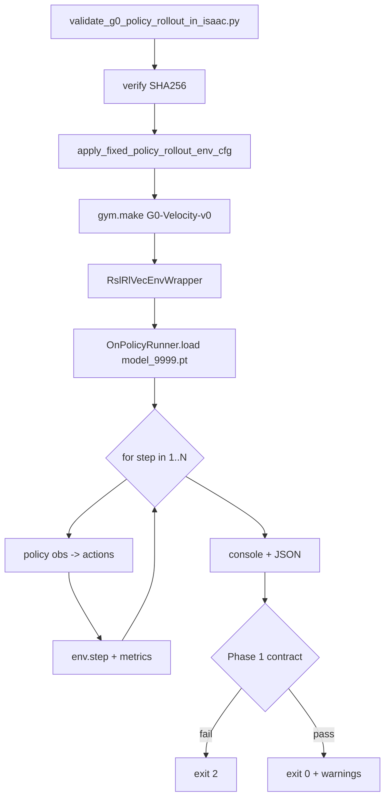

# Policy Rollout Safety Validation Implementation Plan

> **For agentic workers:** REQUIRED SUB-SKILL: Use superpowers:subagent-driven-development (recommended) or superpowers:executing-plans to implement this plan task-by-task. Steps use checkbox (`- [ ]`) syntax for tracking.

**Goal:** Run headless policy rollouts inside Isaac Lab against the fixed RSL-RL checkpoint, collect safety and diagnostic metrics, and hard-fail only on contract violations (Phase 1). This does not validate real-robot deployment readiness.

**Architecture:** Add a standalone validation script (no `play.py` subprocess) that reuses the `OnPolicyRunner` + `RslRlVecEnvWrapper` + `get_inference_policy` loading path from `scripts/rsl_rl/play.py`. Align environment configuration with the passing zero-action release gate. Aggregate metrics to console and optional JSON under `logs/validation/`.

**Tech Stack:** Python 3.11, `g0_isaaclab`, `/home/lz/IsaacLab/isaaclab.sh`, Isaac Lab headless, `rsl-rl-lib`, `torch`, `pytest` (optional Phase 3 gate)

**Constraints (do not violate):**
- Do not restore `mujoco/` or `scripts/sim2sim/`
- Do not send real LowCmd or motor commands
- Do not mix with `humanoid_lab_v0`
- Do not modify reward, PPO, policy checkpoint, or robot assets (read-only inspection only)
- All Isaac Lab commands: `g0_isaaclab` conda env or `isaaclab.sh`

**Fixed checkpoint:**
```text
logs/rsl_rl/g0_velocity/2026-05-14_18-29-19/model_9999.pt
SHA256: 1dc0c434a4b991eaaa435a21b9d4265e0267eb781b69b132bd75a0b5883928cd
```

---

## 0. Repository status (verified at plan time)

| Item | Status |
|------|--------|
| Working branch | `validation/policy-rollout-safety` (exists, checked out) |
| Base | Includes PR #1 merge on `validation/isaac-lowcmd-dryrun`; zero-action 500-step gate fixed |
| Checkpoint on disk | Present; SHA256 matches `tests/conftest.py` |
| `scripts/validation/` | Does not exist yet |
| Reference patterns | `test_release_gate_zero_action_standing.py`, `debug_zero_action_stability.py`, `play.py` |

---

## 1. Branch setup

### 1.1 Decision

- **Use** branch `validation/policy-rollout-safety` (already created from `validation/isaac-lowcmd-dryrun`).
- **Do not** create a new branch unless local state is dirty and needs cleanup first.

### 1.2 Pre-implementation checks

```bash
cd /home/lz/g0_robot_lab/g0_robot_lab
git status -sb
git log -1 --oneline
git merge-base --is-ancestor validation/isaac-lowcmd-dryrun HEAD && echo "contains dryrun base"
```

### 1.3 Workflow

- Keep all commits on `validation/policy-rollout-safety`.
- Merge to `validation/isaac-lowcmd-dryrun` / `main` via PR is out of scope for this plan.

---

## 2. Files to inspect before implementation

### 2.1 Release gate / Isaac tests

| File | Purpose |
|------|---------|
| `tests/isaaclab/test_release_gate_zero_action_standing.py` | Fixed validation env (init pose, disabled events/curriculum, zero velocity command) |
| `tests/isaaclab/test_release_gate_policy_export.py` | Checkpoint path, `play.py` subprocess, `G0_ALLOW_HARDWARE=0` |
| `tests/isaaclab/test_g0_runtime_smoke_headless.py` | `gym.make`, finite obs, action dim 22 |
| `tests/conftest.py` | `RAW_RSL_RL_CHECKPOINT`, `RAW_RSL_RL_CHECKPOINT_SHA256`, `isaac_sim_app` fixture |

### 2.2 Policy / checkpoint contracts

| File | Purpose |
|------|---------|
| `tests/deployment/test_raw_rsl_rl_checkpoint_contract.py` | SHA256 + `torch.load` pattern |
| `tests/deployment/test_exported_policy_artifact_contract.py` | 385→22 export contract (**not** used for rollout inference) |
| `scripts/rsl_rl/play.py` | Policy load + inference loop |
| `scripts/rsl_rl/cli_args.py` | `--checkpoint` and RSL-RL CLI |
| `source/g0_robot_lab/g0_robot_lab/tasks/locomotion/agents/rsl_rl_ppo_cfg.py` | `PPORunnerCfg`, `experiment_name=g0_velocity` |

### 2.3 Task / action / environment

| File | Purpose |
|------|---------|
| `source/g0_robot_lab/g0_robot_lab/tasks/locomotion/__init__.py` | `G0-Velocity-v0` registration |
| `source/g0_robot_lab/g0_robot_lab/tasks/locomotion/robots/g0/velocity_env_cfg.py` | `JointPositionActionCfg(scale=0.12)`, `TerminationsCfg` |
| `source/g0_robot_lab/g0_robot_lab/assets/robots/g0/g0.py` | `G0_JOINT_SDK_NAMES`, `G0_DEFAULT_JOINT_POS` |
| `tests/helpers/isaaclab_runtime.py` | `resolve_action_joint_order` |

### 2.4 Metric collection references (read-only)

| File | Purpose |
|------|---------|
| `scripts/debug/debug_zero_action_stability.py` | Termination diagnostics, effort ratio, root euler, 4/5-tuple `env.step` handling |
| `tests/helpers/deployment_dryrun.py` | **Do not use** for rollout; confirms LowCmd path stays isolated |

### 2.5 Documentation

| File | Purpose |
|------|---------|
| `docs/pre_deployment_validation.md` | Validation tiers, hardware prohibition |
| `docs/run_commands.md` | Command style, `g0_isaaclab`, `isaaclab.sh` |
| `docs/observation_action_interface.md` | obs 385 / action 22, action scale |
| `docs/superpowers/specs/2026-05-18-pre-deployment-validation-*.md` | Historical design |

---

## 3. Files to add or modify

### Phase 1 (primary deliverable)

| Action | Path | Responsibility |
|--------|------|----------------|
| **Create** | `scripts/validation/validate_g0_policy_rollout_in_isaac.py` | Entry: SHA verify, env, policy load, rollout, metrics, exit code |
| **Create (recommended)** | `scripts/validation/_rollout_env_cfg.py` | `apply_fixed_policy_rollout_env_cfg(env_cfg, *, num_envs, root_z=0.233)` |
| **Create (recommended)** | `scripts/validation/_rollout_metrics.py` | `RolloutMetrics` aggregator, Phase 1 pass/fail |
| **Create (recommended)** | `scripts/validation/_rollout_io.py` | JSON to `logs/validation/`, console summary |

**Phase 1 must not modify:** `velocity_env_cfg.py`, `rsl_rl_ppo_cfg.py`, `g0.py`, `play.py`, rewards, PPO, checkpoint.

### Phase 2 (docs + JSON polish)

| Action | Path |
|--------|------|
| **Create** | `docs/policy_rollout_safety_validation.md` |
| **Modify** | `docs/run_commands.md` — add "Policy Rollout Safety" section |
| **Modify** | `docs/pre_deployment_validation.md` — new optional tier (not default CI until Phase 3) |

### Phase 3 (optional release gate)

| Action | Path |
|--------|------|
| **Create** | `tests/isaaclab/test_release_gate_policy_rollout_safety.py` |
| **Modify** | `pyproject.toml` | Optional marker `policy_rollout` or reuse `release_gate` + `slow` |
| **Modify** | `tests/unit/test_docs_contract.py` | If doc anchors are added |

---

## 4. Policy loading strategy

### 4.1 Checkpoint identity (hard fail)

```python
from pathlib import Path
import hashlib

REPO_ROOT = Path(__file__).resolve().parents[2]
DEFAULT_CHECKPOINT = REPO_ROOT / "logs/rsl_rl/g0_velocity/2026-05-14_18-29-19/model_9999.pt"
EXPECTED_SHA256 = "1dc0c434a4b991eaaa435a21b9d4265e0267eb781b69b132bd75a0b5883928cd"


def verify_checkpoint(path: Path) -> str:
    if not path.is_file():
        raise FileNotFoundError(f"Checkpoint missing: {path}")
    digest = hashlib.sha256(path.read_bytes()).hexdigest()
    if digest != EXPECTED_SHA256:
        raise ValueError(f"SHA256 mismatch: got {digest}, expected {EXPECTED_SHA256}")
    return digest
```

- **Never** rewrite, re-export, or overwrite `model_9999.pt`.
- CLI `--checkpoint` defaults to the path above; absolute paths allowed but SHA must match.

### 4.2 Load path (align with `play.py`, not ONNX/TorchScript)

1. `parse_rsl_rl_cfg("G0-Velocity-v0", args_cli)` or `PPORunnerCfg()` + `cli_args.update_rsl_rl_cfg`.
2. `gym.make("G0-Velocity-v0", cfg=env_cfg)`.
3. `env = RslRlVecEnvWrapper(env, clip_actions=agent_cfg.clip_actions)`.
4. `runner = OnPolicyRunner(env, agent_cfg.to_dict(), log_dir=None, device=agent_cfg.device)`.
5. `runner.load(resume_path)` — read-only.
6. `policy = runner.get_inference_policy(device=env.unwrapped.device)`.
7. Loop: `obs = env.get_observations()` → `actions = policy(obs)` → `env.step(actions)`; on `dones`, `policy.reset(dones)` (same as `play.py`).

**Do not use:**
- `play.py` subprocess (no fine-grained metrics; triggers JIT/ONNX export side effects).
- `exported/policy.onnx` as rollout source (may diverge from training runner normalization).

### 4.3 Optional sanity (non-blocking)

- `torch.load(checkpoint, map_location="cpu")` after SHA pass, before `runner.load`, to separate corrupt files from runner incompatibility.

### 4.4 Environment

```python
os.environ["G0_ALLOW_HARDWARE"] = "0"  # set at script entry
```

Do not import `deployment_dryrun`, `FakeLowCmd`, or socket helpers.

---

## 5. Environment setup

### 5.1 `apply_fixed_policy_rollout_env_cfg`

Mirror `tests/isaaclab/test_release_gate_zero_action_standing.py`:

- `scene.num_envs = num_envs` (default 1)
- `init_state`: pos `(0, 0, 0.233)`, rot identity, velocities zero, `joint_vel={".*": 0}`
- Disable: `physics_material`, `base_external_force_torque`, `reset_base`, `reset_robot_joints`, `push_robot`, `add_base_mass`
- Disable curriculum: `lin_vel_cmd_levels`, `ang_vel_cmd_levels`
- Fixed standing command: `rel_standing_envs=1.0`, velocity ranges all zero, `resampling_time_range=(1e9, 1e9)`
- `observations.policy.enable_corruption = False`
- `rewards.undesired_contacts = None` (reward-only; **terminations stay active**)

CLI: `--root-z 0.233` (default matches release gate).

### 5.2 Explicit non-goals

- No LowCmd / hardware transport.
- No reward/PPO/terrain-training changes.
- No retrain or checkpoint replacement.

### 5.3 Agent / seed

- Fixed `agent_cfg.seed` (e.g. 42) or `--seed`; record in JSON.
- `env_cfg.sim.device` from `AppLauncher` / `--device`.

### 5.4 Command mode (Phase 1)

| Mode | Description |
|------|-------------|
| `standing` (default) | Same zero-velocity command as zero-action release gate |
| `forward` (future) | Fixed forward velocity — defer to Phase 2+; document only |

---

## 6. Rollout design

### 6.1 CLI (`validate_g0_policy_rollout_in_isaac.py`)

```text
--task G0-Velocity-v0          # default
--checkpoint PATH             # default: fixed model_9999.pt
--steps INT                   # default 500; also 1000, 2000
--num-envs N                  # default 1
--seed INT
--json-out PATH               # optional; default logs/validation/policy_rollout_<ts>.json
--no-json
--effort-ratio-threshold 0.9  # stats only in Phase 1
# AppLauncher: --headless, etc.
```

### 6.2 Main loop

- **Total steps** = `--steps` (accumulated across episodes; do not stop early on `done`).
- Each step:
  1. `obs = env.get_observations()`; assert finite.
  2. `actions = policy(obs)`; assert shape `(num_envs, 22)` and finite.
  3. `env.step(actions)`; handle 4- or 5-tuple returns (reuse debug script logic).
  4. Sample `base_env.scene["robot"]`; read `termination_manager` terms on `done`.
  5. `policy.reset(dones)`.
- `reset_count` = number of steps where `done` is True.

### 6.3 Target joint positions

For `JointPositionActionCfg(scale=0.12, use_default_offset=True)`:

```python
target[j] = default_pos[j] + 0.12 * clip(action[j], -1.0, 1.0)
```

Prefer `robot.data.joint_pos_target`; fall back to formula.  
`target_delta_max` = max abs(target - joint_pos) per step.

### 6.4 Joint limit margin

- Read `robot.data.joint_pos_limits` or `soft_joint_pos_limits`.
- `margin_min` = min(lower - pos, pos - upper) across joints.

---

## 7. Safety metrics

| Metric | Source | Aggregation |
|--------|--------|-------------|
| Action finite | `actions` | Any non-finite → Phase 1 **FAIL** |
| Action min/max/mean/std | `actions` | Running + final |
| Action outside [-1, 1] count | Policy output (and env-side if clip differs) | Per-step count, total |
| Target joint pos min/max | `joint_pos_target` or computed | Running |
| Target delta max | target - `joint_pos` | Max over steps |
| Joint limit margin | limits vs `joint_pos` | Running min |
| root_z min/max/mean | `root_pos_w[:, 2]` | Running |
| base_height termination count | `termination_manager` on done | Sum |
| bad_orientation termination count | Same | Sum |
| time_out / truncated count | `truncated` / `time_out` term | Sum |
| reset count | `done` per step | Sum |
| Joint pos/vel min/max | `robot.data` | Running |
| Applied/computed torque min/max | `applied_torque` / `computed_torque` | Running |
| effort ratio max | abs(torque) / abs(limit) | Global max |
| Steps with effort ratio > 0.9 | Same | Count |
| Base roll/pitch/yaw or projected gravity | `root_quat_w` → euler deg; obs or `robot.data` | min/max/mean |

Reuse patterns from `debug_zero_action_stability.py` but aggregate (optional `--verbose` every N steps).

---

## 8. Pass/fail policy

### Phase 1 (script exit code)

| Condition | Result |
|-----------|--------|
| Checkpoint missing | exit 2 |
| SHA256 mismatch | exit 2 |
| `gym.make` / `runner.load` failure | exit 2 |
| NaN/Inf in obs or actions | exit 2 |
| Action shape != `(num_envs, 22)` | exit 2 |
| All other (falls, terminations, high effort) | exit 0 + diagnostic **WARN** |

Console footer:

```text
=== Policy Rollout Safety (Phase 1) ===
RESULT: PASS (contract) | FAIL (contract)
WARNINGS: ...
```

### Phase 2 (proposed release-gate thresholds — calibrate after diagnostic runs)

Run 500/1000/2000 diagnostics before enabling pytest failures.

| Metric | Proposed threshold | Notes |
|--------|-------------------|-------|
| NaN/Inf | 0 | Same as Phase 1 |
| Action outside [-1, 1] | 0 steps | Check policy output; note `clip_actions` |
| effort_ratio > 0.9 | ≤ 50 / 500; ≤ 100 / 1000; ≤ 200 / 2000 | Proportional |
| effort_ratio max | ≤ 1.05 | Numeric tolerance |
| reset_count @ 500 | Report only initially | Zero-cmd standing may still fall |
| base_height @ 500 | Report in Phase 2a; optional ≤ 1 in Phase 2b | Needs baseline |
| root_z min | Report only | Correlates with termination |

Order: diagnostics → update `docs/policy_rollout_safety_validation.md` → add `test_release_gate_policy_rollout_safety.py`.

---

## 9. Output format

### 9.1 Console (required)

Include: full command line, checkpoint path + SHA256, steps, num_envs, seed, device, Phase 1 PASS/FAIL, termination counts, action stats, root_z stats, effort stats.

### 9.2 JSON (default on; `--no-json` to disable)

Path: `logs/validation/policy_rollout_YYYYMMDD_HHMMSS.json`

```json
{
  "schema_version": 1,
  "command": ["..."],
  "checkpoint": {"path": "...", "sha256": "..."},
  "config": {"task": "G0-Velocity-v0", "steps": 500, "num_envs": 1, "seed": 42},
  "phase": 1,
  "result": {"contract_pass": true, "exit_code": 0},
  "metrics": {
    "action": {"min": 0.0, "max": 0.0, "out_of_range_count": 0},
    "root_z": {"min": 0.0, "max": 0.0, "mean": 0.0},
    "terminations": {"base_height": 0, "bad_orientation": 0, "time_out": 0},
    "resets": 0,
    "effort": {"ratio_max": 0.0, "steps_above_0_9": 0}
  },
  "warnings": []
}
```

---

## 10. Validation commands

Repo root: `/home/lz/g0_robot_lab/g0_robot_lab`  
Environment: `conda activate g0_isaaclab` or `TERM=xterm conda run -n g0_isaaclab ...`

### 10.1 Phase 1 diagnostics (script)

**500 steps:**

```bash
cd /home/lz/g0_robot_lab/g0_robot_lab
TERM=xterm conda run -n g0_isaaclab /home/lz/IsaacLab/isaaclab.sh -p scripts/validation/validate_g0_policy_rollout_in_isaac.py \
  --task G0-Velocity-v0 \
  --checkpoint logs/rsl_rl/g0_velocity/2026-05-14_18-29-19/model_9999.pt \
  --headless \
  --steps 500 \
  --num-envs 1
```

**1000 steps:** change `--steps 500` to `--steps 1000`.

**2000 steps:** change `--steps 500` to `--steps 2000`.

### 10.2 Regression (existing tiers)

```bash
python -m pytest tests/unit -m "unit"
python -m pytest tests/deployment -m "deployment_dryrun and hardware_forbidden"
/home/lz/IsaacLab/isaaclab.sh -p -m pytest tests/isaaclab -m "isaaclab"
/home/lz/IsaacLab/isaaclab.sh -p -m pytest tests -m "release_gate"
```

### 10.3 Phase 3 (optional pytest)

```bash
/home/lz/IsaacLab/isaaclab.sh -p -m pytest tests/isaaclab/test_release_gate_policy_rollout_safety.py -m "release_gate" -v
```

Extract `run_policy_rollout_validation(...)` from the script into `scripts/validation/_rollout_core.py` for test reuse.

---

## 11. Documentation plan

### 11.1 Create `docs/policy_rollout_safety_validation.md`

Must state:

1. **Purpose:** Policy behavior and numerical safety in Isaac Lab only — not real-robot deployment readiness.
2. **Relation to tiers:** unit / deployment_dryrun / isaaclab smoke / release_gate (zero-action, export) / this diagnostic stage.
3. **Fixed checkpoint** path and SHA256 (match `tests/conftest.py`).
4. **Fixed env conditions** (aligned with zero-action release gate).
5. **Phase 1 vs Phase 2** pass criteria.
6. **Commands** for 500/1000/2000 steps and JSON output location.
7. **Prohibitions:** real LowCmd, MuJoCo sim2sim, `humanoid_lab_v0`, changing checkpoint/reward/PPO.
8. **Disclaimer:**
   > Passing contract checks and reporting stable diagnostics in Isaac Lab does **not** indicate readiness for real-robot deployment, hardware bring-up, or LowCmd transmission.

### 11.2 Update `docs/run_commands.md`

Add "Policy Rollout Safety (Isaac Lab only)" after Release Gate; link to the new doc.

### 11.3 Update `docs/pre_deployment_validation.md`

Document optional tier via `scripts/validation/validate_g0_policy_rollout_in_isaac.py`; not in default CI until Phase 2 thresholds are stable.

---

## Phased task breakdown

### Phase 0 — Prep (~15 min)

- [ ] Confirm branch `validation/policy-rollout-safety` is clean and includes PR #1
- [ ] `mkdir -p scripts/validation logs/validation`
- [ ] Read all files in Section 2

### Phase 1 — Core script (~2–4 h)

**Task 1.1: Shared env config**

- Create: `scripts/validation/_rollout_env_cfg.py`
- Implement `apply_fixed_policy_rollout_env_cfg(env_cfg, *, num_envs=1, root_z=0.233)`
- Optional: refactor `test_release_gate_zero_action_standing.py` to call the same helper (DRY, no behavior change)

**Task 1.2: Metrics and I/O**

- Create: `scripts/validation/_rollout_metrics.py` — `RolloutMetrics`, `update(step, ...)`, `finalize_phase1()`
- Create: `scripts/validation/_rollout_io.py` — `print_summary()`, `write_json()`

**Task 1.3: Main script**

- Create: `scripts/validation/validate_g0_policy_rollout_in_isaac.py`
- AppLauncher → verify SHA → env cfg → `gym.make` → `RslRlVecEnvWrapper` → `OnPolicyRunner.load` → rollout → exit code
- Port from `debug_zero_action_stability.py`: step tuple parsing, euler, termination, effort

**Task 1.4: Local verification**

- Run 500/1000/2000 commands
- Confirm JSON under `logs/validation/`
- Regression: unit, deployment_dryrun, isaaclab, release_gate

**Task 1.5: Commit**

```bash
git add scripts/validation/
git commit -m "feat(validation): add Isaac Lab policy rollout safety script (phase 1 diagnostic)"
```

### Phase 2 — Docs and threshold calibration (~1–2 h)

- [ ] Run three diagnostics; fill Phase 2 threshold table in `docs/policy_rollout_safety_validation.md`
- [ ] Update `docs/run_commands.md` and `docs/pre_deployment_validation.md`
- [ ] Commit docs

### Phase 3 — Release gate test (optional, ~2 h)

- [ ] Extract `run_policy_rollout_validation(...)` to `scripts/validation/_rollout_core.py`
- [ ] Create: `tests/isaaclab/test_release_gate_policy_rollout_safety.py` (`release_gate`, `slow`)
- [ ] Apply Phase 2 thresholds; run `pytest -m release_gate`
- [ ] Update `tests/unit/test_docs_contract.py` if doc anchors added

---

## Architecture



---

## Self-review (spec coverage)

| Requirement | Section |
|-------------|---------|
| Branch setup | §1 |
| Files to inspect | §2 |
| Files to add/modify | §3 |
| Policy loading | §4 |
| Environment setup | §5 |
| Rollout design | §6 |
| Safety metrics | §7 |
| Pass/fail | §8 |
| Output format | §9 |
| Validation commands | §10 |
| Documentation | §11 |

No placeholders: paths, SHA, commands, and exit codes are concrete.

---

## Execution handoff

**Plan saved to:** `docs/superpowers/plans/2026-05-19-policy-rollout-safety-validation.md`

**Two execution options:**

1. **Subagent-Driven (recommended)** — one fresh subagent per phase/task with review between tasks.
2. **Inline Execution** — implement Phase 1 in this session using `executing-plans` with checkpoints.

Which approach should we use next?
