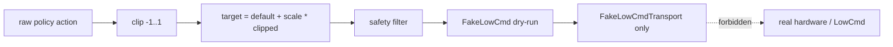

# LowCmd Mapping and Safety Audit Implementation Plan

> **For agentic workers:** REQUIRED SUB-SKILL: Use superpowers:subagent-driven-development (recommended) or superpowers:executing-plans to implement this plan task-by-task. Steps use checkbox (`- [ ]`) syntax for tracking.

**Goal:** Validate the full dry-run mapping chain in validation-only mode:

`raw policy action → clipped action [-1, 1] → target joint position → safety filter → LowCmd-style dry-run command`

This stage does not prove real-robot deployment readiness and must not send real motor commands.

**Architecture:** Upgrade the minimal `build_fake_lowcmd` path into shared `_safety_filter.py` and `_lowcmd_mapping.py` modules; add an offline mapping validation script and optional Isaac Lab policy sampling diagnostic; lock contracts with deployment unit tests and document the 22-joint mapping table.

**Tech Stack:** Python 3.11, `g0_isaaclab`, `/home/lz/IsaacLab/isaaclab.sh`, pytest, `torch` (checkpoint identity only; do not modify checkpoint)

**Constraints (do not violate):**
- Do not send real LowCmd; do not connect to real hardware; do not enter real motor command paths
- Do not restore `mujoco/` or `scripts/sim2sim/`; do not continue MuJoCo sim2sim
- Do not mix with `humanoid_lab_v0`
- Do not modify reward, PPO, policy checkpoint, or robot assets (read-only inspection only)
- All Isaac Lab commands: `g0_isaaclab` conda env or `isaaclab.sh`

**Fixed checkpoint:**
```text
logs/rsl_rl/g0_velocity/2026-05-14_18-29-19/model_9999.pt
SHA256: 1dc0c434a4b991eaaa435a21b9d4265e0267eb781b69b132bd75a0b5883928cd
```

**Known policy rollout diagnostics (inform this stage):**
- raw policy action can exceed `[-1, 1]` (min -2.9596 @ step 5; max 2.4360 @ step 892)
- deployment-facing path must clip before any LowCmd-compatible representation
- effort ratio worst = 1.0 @ step 0; joint limit margin worst ≈ -0.05134 @ step 0; target delta worst ≈ 0.86026 @ step 0

---

## 0. Repository status (verified at plan time)

| Item | Status |
|------|--------|
| Base branch | `validation/isaac-lowcmd-dryrun` (includes merged PR #2 policy rollout) |
| Working branch | Create `validation/lowcmd-mapping-safety-audit` |
| `scripts/validation/` | Policy rollout suite exists (`_rollout_core.py`, etc.) |
| Existing dry-run | `deployment_dryrun.py`: clip + `default + scale*clipped`; no full safety filter / motor_id |
| Isaac release gate | `test_release_gate_policy_rollout_safety.py` (500 steps) passed |
| Stage nature | Validation-only; passing does not mean real-robot readiness |

---

## 1. Branch setup

### 1.1 Decision

- [ ] Create and check out `validation/lowcmd-mapping-safety-audit` from `validation/isaac-lowcmd-dryrun`
- [ ] Keep all commits on that branch; PR merge is out of scope for this plan

### 1.2 Pre-implementation checks

```bash
cd /home/lz/g0_robot_lab/g0_robot_lab
git fetch origin
git checkout validation/isaac-lowcmd-dryrun
git pull --ff-only origin validation/isaac-lowcmd-dryrun 2>/dev/null || true
git status -sb
git log -3 --oneline
git merge-base --is-ancestor validation/isaac-lowcmd-dryrun HEAD && echo "on dryrun base"
```

### 1.3 Create working branch

```bash
git checkout -b validation/lowcmd-mapping-safety-audit
```

---

## 2. Files to inspect before implementation

### 2.1 Policy rollout (mapping chain reference)

| File | Purpose |
|------|---------|
| `scripts/validation/validate_g0_policy_rollout_in_isaac.py` | CLI entry, checkpoint args |
| `scripts/validation/_rollout_core.py` | `actions.clamp(-1,1)`, `default+0.12*clipped`, target_delta, effort/limit |
| `scripts/validation/_rollout_metrics.py` | raw vs clipped stats, worst-case records |
| `scripts/validation/_rollout_env_cfg.py` | fixed env aligned with zero-action gate |
| `scripts/validation/_rollout_io.py` | console/JSON output format |

### 2.2 Tests and dry-run infrastructure

| File | Purpose |
|------|---------|
| `tests/deployment/test_lowcmd_generation_dryrun.py` | existing zero/one-hot/clip contracts |
| `tests/deployment/test_lowcmd_transport_guardrails.py` | `G0_ALLOW_HARDWARE=0`, socket block |
| `tests/deployment/test_sim2sim_interface_snapshot.py` | doc/source anchor consistency |
| `tests/helpers/deployment_dryrun.py` | `FakeLowCmd` / `build_fake_lowcmd` (refactor to thin wrapper) |
| `tests/helpers/isaaclab_runtime.py` | `resolve_action_joint_order` |
| `tests/conftest.py` | checkpoint path, SHA256, marker fixtures |
| `tests/isaaclab/test_g0_runtime_smoke_headless.py` | action order == `G0_JOINT_SDK_NAMES` |
| `tests/isaaclab/test_release_gate_policy_rollout_safety.py` | 500-step rollout gate (do not weaken) |

### 2.3 Robot / task contracts (read-only)

| File | Purpose |
|------|---------|
| `source/g0_robot_lab/g0_robot_lab/assets/robots/g0/g0.py` | `G0_JOINT_SDK_NAMES`, `G0_DEFAULT_JOINT_POS`, servo groups |
| `source/g0_robot_lab/g0_robot_lab/assets/robots/g0/g0_actuators.py` | effort/velocity rated values, right-angle ratios |
| `source/g0_robot_lab/g0_robot_lab/tasks/locomotion/robots/g0/velocity_env_cfg.py` | `JointPositionActionCfg(scale=0.12, preserve_order=True)` |
| `tests/unit/test_g0_joint_contract.py` | SDK joint order, default pose, servo partition |
| `tests/unit/test_velocity_env_static_contract.py` | action cfg static contract |

### 2.4 Documentation

| File | Purpose |
|------|---------|
| `docs/observation_action_interface.md` | 385→22, target formula, joint order |
| `docs/pre_deployment_validation.md` | layered validation workflow |
| `docs/run_commands.md` | command templates |
| `docs/policy_rollout_safety_validation.md` | prior stage results and disclaimer |
| `docs/g0_actuator_parameters.md` (if present) | kp/kd/torque reference |

### 2.5 Do not modify in this stage

- `velocity_env_cfg.py`, `rsl_rl_ppo_cfg.py`, `g0.py` (except read-only imports), `play.py`, rewards, PPO, checkpoint, USD/URDF assets

---

## 3. Joint order audit

### 3.1 Audit dimensions and sources

| Dimension | Authority | Verification |
|-----------|-----------|----------------|
| Isaac action joint order | `velocity_env_cfg.ActionsCfg.joint_pos` + `resolve_action_joint_order` | existing smoke test; new contract test |
| policy action index `i` | maps to `G0_JOINT_SDK_NAMES[i]` | static + per-joint one-hot tests |
| robot joint names | `robot.data.joint_names` | mapping script prints diff in Isaac mode |
| SDK / LowCmd motor id | **convention: `motor_id = SDK index` (0..21)** | `G0_MOTOR_ID_BY_JOINT` or derived table in audit doc |
| default joint position | `G0_DEFAULT_JOINT_POS` | cross-check `G0_CFG.init_state.joint_pos` |
| action scale | `0.12` | static AST + runtime action term |
| joint position limits | `soft_joint_pos_limits` / URDF | per-joint table in audit doc |
| effort limits | `g0_actuators` + `effort_limit_sim` | standard vs right-angle 16+6 |
| velocity limits | `velocity_limit_sim` | same |
| servo type | `G0_RIGHT_ANGLE_SERVO_JOINT_NAMES` | existing unit test |
| direction sign | mirrored l/r pitch defaults | default pose tests + doc table |

### 3.2 Deliverables

- [ ] 22-row mapping table in `docs/lowcmd_mapping_safety_audit.md` (index, motor_id, joint_name, default_q, scale, pos_lower, pos_upper, vel_limit, effort_limit, servo_type, sign_note)
- [ ] `tests/deployment/test_lowcmd_mapping_contract.py`: `motor_id == index`, `len==22`, names == `G0_JOINT_SDK_NAMES`
- [ ] Optional: `scripts/validation/_joint_contract_tables.py` loads constants from `g0.py` / `g0_actuators.py` without Isaac

### 3.3 Isaac runtime cross-check

- [ ] `validate_g0_lowcmd_mapping.py --audit-joint-order-only`: one env build, print `action_joint_order` vs `G0_JOINT_SDK_NAMES`; mismatch → exit 2

---

## 4. Action-to-target mapping audit

### 4.1 Required chain invariants

```text
raw_action                    # policy output, may be out of range
clipped = clip(raw, -1, 1)
target_pre = default_joint_pos[j] + action_scale * clipped[j]
target_safe = safety_filter.position_clamp(target_pre, limits)
```

### 4.2 Hard rules (contract tests)

- [ ] **Never** use raw action directly for target (e.g. `action=10` must not yield `default + scale*10`)
- [ ] `action=0` → `target == default` (tolerance `1e-6`)
- [ ] `action=±1` → `target == default ± scale`
- [ ] `action=10` → same target as `action=1` after clip
- [ ] post-safety target within `[lower, upper]`
- [ ] `|target - prev_target| <= max_target_delta` (initial candidate `0.25` rad/step; report step-0 worst ~0.86 as diagnostic in this stage)

### 4.3 Alignment with rollout

- [ ] Mirror `_rollout_core._compute_target_and_limits` logic in `_lowcmd_mapping.py` (no Isaac import in deployment tests)
- [ ] Isaac script: per-step compare rollout clipped+target vs `map_policy_to_lowcmd_dry_run` q; max error `< 1e-5`

---

## 5. Safety filter design

### 5.1 Module: `scripts/validation/_safety_filter.py`

Pure functions; no Isaac; no sockets. Suggested API:

```python
@dataclass(frozen=True)
class SafetyLimits:
    pos_lower: Mapping[str, float]
    pos_upper: Mapping[str, float]
    vel_limit: Mapping[str, float]
    effort_limit: Mapping[str, float]
    max_target_delta: float
    max_action_delta: float
    max_command_age_s: float

@dataclass
class SafetyState:
    prev_target: dict[str, float]
    prev_action: dict[str, float] | None
    last_obs_time: float | None

class SafetyFilter:
    def apply(
        self,
        *,
        raw_action: Sequence[float],
        joint_order: Sequence[str],
        default_joint_pos: Mapping[str, float],
        action_scale: float,
        limits: SafetyLimits,
        state: SafetyState,
        now: float,
        emergency_stop: bool,
        hardware_enabled: bool,
    ) -> SafetyFilterResult: ...
```

### 5.2 Filter stages (fixed order)

| Stage | Behavior | Failure mode |
|-------|----------|--------------|
| 0. Guards | `hardware_enabled` must be False; `emergency_stop` → hold-safe (default or freeze prev) | hard FAIL in tests |
| 1. Finiteness | NaN/Inf in raw_action → reject, no motor cmd | hard FAIL |
| 2. Action clip | `clip(raw, -1, 1)` | — |
| 3. Action delta | `|clipped - prev| <= max_action_delta` | v1: clamp + warning; test both clamp and reject paths if implemented |
| 4. Target | `default + scale * clipped` | — |
| 5. Position clamp | clamp to `[lower, upper]` | hard FAIL if still out of bounds |
| 6. Target delta | `|target - prev| <= max_target_delta` | v1: clamp + diagnostic |
| 7. Velocity | `dq_target` default 0; if non-zero, limit to `±vel_limit` | — |
| 8. Torque | `tau_ff` default 0; limit to `±effort_limit` | non-finite → hard FAIL |
| 9. Stale obs | `now - last_obs > max_command_age_s` → reject | hard FAIL in tests |
| 10. Output check | all motor fields finite | hard FAIL |

### 5.3 `deployment_dryrun.py` refactor

- [ ] `build_fake_lowcmd` calls `_safety_filter` + `_lowcmd_mapping` (same `sys.path` pattern as rollout scripts)
- [ ] Keep `dry_run=True` enforced; `FakeLowCmdTransport` unchanged

---

## 6. LowCmd-style dry-run validation

### 6.1 Extend `FakeMotorCommand` / `FakeLowCmd`

| Field | Description |
|-------|-------------|
| `motor_id` | `0..21`, same as SDK index |
| `joint_name` | redundant readability |
| `q` | position target after safety |
| `dq` | velocity target (default 0) |
| `kp`, `kd` | from config table or 0 in v1 |
| `tau_ff` | default 0, effort-clamped |
| `effort_limit` | per motor from `g0_actuators` |
| `source_raw_action` | diagnostic |
| `source_clipped_action` | contract |

### 6.2 Validation checks

- [ ] 22 motors; ids continuous and consistent with joint table
- [ ] all command components finite
- [ ] `dry_run is True`; only `FakeLowCmdTransport`
- [ ] no `socket.send*`; no Unitree SDK import (existing guardrails)
- [ ] optional Isaac: N-step policy loop → `map_policy_to_lowcmd_dry_run` per step; worst-case summary

### 6.3 Module: `scripts/validation/_lowcmd_mapping.py`

```python
def map_policy_to_lowcmd_dry_run(
    raw_action: Sequence[float],
    *,
    joint_order: Sequence[str],
    default_joint_pos: Mapping[str, float],
    action_scale: float = 0.12,
    safety: SafetyFilter,
    state: SafetyState,
    kp_by_joint: Mapping[str, float] | None = None,
    kd_by_joint: Mapping[str, float] | None = None,
    control_dt: float = 0.02,
) -> FakeLowCmd: ...
```

---

## 7. Proposed files to add or modify

| Action | Path |
|--------|------|
| Add | `scripts/validation/validate_g0_lowcmd_mapping.py` |
| Add | `scripts/validation/_lowcmd_mapping.py` |
| Add | `scripts/validation/_safety_filter.py` |
| Add | `scripts/validation/_joint_contract_tables.py` (optional) |
| Add | `tests/deployment/test_lowcmd_mapping_contract.py` |
| Add | `tests/deployment/test_safety_filter_contract.py` |
| Modify | `tests/helpers/deployment_dryrun.py` |
| Modify | `tests/deployment/test_lowcmd_generation_dryrun.py` |
| Add | `docs/lowcmd_mapping_safety_audit.md` |
| Modify | `docs/run_commands.md` |
| Modify | `docs/pre_deployment_validation.md` |
| Optional Phase F | `tests/isaaclab/test_release_gate_lowcmd_mapping.py` |
| Optional | `logs/validation/lowcmd_mapping_*.json` |

**Do not add:** real LowCmd SDK bindings, UDP/serial, MuJoCo directories

---

## 8. Test strategy

### 8.1 Deployment unit (`deployment_dryrun` + `hardware_forbidden`)

| Case | Input | Expected |
|------|-------|----------|
| zero action | `0`×22 | q=default, clipped=0 |
| +1 / -1 | one-hot ±1 | q=default±scale |
| overflow | `10` on joint 0 | same as +1 |
| NaN | any NaN | reject / no valid cmd |
| Inf | any Inf | reject / no valid cmd |
| fast jump | 0 → all 1 | action_delta or target_delta clamp applies |
| stale obs | `now - last_obs > max_age` | hard FAIL |
| e-stop | `emergency_stop=True` | hold default or freeze; no large q |
| hardware forbidden | `hardware_enabled=True` | immediate FAIL |
| motor id | full chain | id 0..21 matches joint names |
| no raw bypass | action=10 | target ≠ default+10*scale |

### 8.2 Mapping contract

- [ ] table has 22 rows; byte-match `G0_JOINT_SDK_NAMES`
- [ ] doc anchors referenced by unit or new test

### 8.3 Optional Isaac integration (not default CI)

- [ ] `validate_g0_lowcmd_mapping.py --steps 500` with fixed checkpoint; dry-run cmds only; no real transport
- [ ] compare clipped stats with rollout: still in `[-1, 1]`

### 8.4 Regression

- [ ] existing 16 unit + 13 deployment + Isaac non-release + `release_gate` all pass

---

## 9. Pass/fail policy

### 9.1 Hard FAIL (this stage)

| Condition | Layer |
|-----------|-------|
| NaN/Inf in command | deployment + script exit 2 |
| raw action used without clip for target | deployment contract |
| motor_id inconsistent with index/joint | deployment contract |
| joint order ≠ `G0_JOINT_SDK_NAMES` | unit/deployment/Isaac audit |
| post-safety target outside position limits | deployment |
| real hardware transport / `G0_ALLOW_HARDWARE!=0` | existing guardrail |
| missing safety filter path | new tests |
| emergency_stop ignored | safety filter tests |
| `dry_run=False` or non-fake transport | hard FAIL |

### 9.2 Diagnostic-only (record, do not block)

| Condition | Notes |
|-----------|-------|
| raw action out of range count | expected; matches rollout |
| target_delta > threshold @ step 0 | investigate vs rollout 0.86 |
| effort ratio = 1.0 | sim saturation signal |
| joint limit margin slightly negative @ reset | confirm reset semantics before gating |
| kp/kd = 0 | no real PD tuning in v1 |

### 9.3 Phase F candidates (not active in v1)

- [ ] 500-step `release_gate`: `test_release_gate_lowcmd_mapping_chain.py`
- [ ] thresholds: `max_target_delta`, stale obs, action_delta; step-0 exemption TBD

---

## 10. Documentation plan

### 10.1 New `docs/lowcmd_mapping_safety_audit.md`

- [ ] Purpose: dry-run mapping + safety audit
- [ ] Scope: offline + optional Isaac sampling; no real robot
- [ ] Prohibitions: no real LowCmd, no hardware, no motor power
- [ ] Mapping table (§3.2)
- [ ] Safety filter contract (stage order, config, failure semantics)
- [ ] Dry-run command schema (`FakeLowCmd` fields)
- [ ] Link to `policy_rollout_safety_validation.md`
- [ ] Deployment-readiness disclaimer

### 10.2 Update existing docs

- [ ] `docs/pre_deployment_validation.md`: new section for this stage
- [ ] `docs/run_commands.md`: mapping script and pytest selectors
- [ ] `docs/observation_action_interface.md`: cross-link “must clip before target” if needed

---

## 11. Validation commands

### 11.1 Conda / path

```bash
cd /home/lz/g0_robot_lab/g0_robot_lab
source ~/miniconda3/etc/profile.d/conda.sh 2>/dev/null || source ~/anaconda3/etc/profile.d/conda.sh 2>/dev/null || true
conda activate g0_isaaclab
```

### 11.2 Unit tier

```bash
python -m pytest tests/unit -m "unit" -q
```

### 11.3 Deployment tier (including new contracts)

```bash
python -m pytest tests/deployment -m "deployment_dryrun and hardware_forbidden" -q
python -m pytest tests/deployment/test_lowcmd_mapping_contract.py tests/deployment/test_safety_filter_contract.py -q
```

### 11.4 Mapping validation script (offline, no Isaac)

```bash
python scripts/validation/validate_g0_lowcmd_mapping.py \
  --mode offline-contract \
  --emit-json logs/validation/lowcmd_mapping_offline.json
```

### 11.5 Mapping validation script (Isaac + fixed checkpoint, dry-run only)

```bash
/home/lz/IsaacLab/isaaclab.sh -p scripts/validation/validate_g0_lowcmd_mapping.py \
  --mode isaac-policy-sample \
  --task G0-Velocity-v0 \
  --checkpoint logs/rsl_rl/g0_velocity/2026-05-14_18-29-19/model_9999.pt \
  --headless \
  --steps 500 \
  --num-envs 1 \
  --emit-json logs/validation/lowcmd_mapping_isaac_500.json
```

### 11.6 Isaac Lab non-release smoke

```bash
/home/lz/IsaacLab/isaaclab.sh -p -m pytest tests/isaaclab -m "isaaclab" -q
```

### 11.7 Full release gate regression

```bash
/home/lz/IsaacLab/isaaclab.sh -p -m pytest tests -m "release_gate" -q
```

### 11.8 Prior rollout diagnostic regression (optional)

```bash
/home/lz/IsaacLab/isaaclab.sh -p scripts/validation/validate_g0_policy_rollout_in_isaac.py \
  --task G0-Velocity-v0 \
  --checkpoint logs/rsl_rl/g0_velocity/2026-05-14_18-29-19/model_9999.pt \
  --headless --steps 500 --num-envs 1
```

---

## 12. Phased task breakdown

### Phase A — Branch and audit table (read-only + doc skeleton)

- [ ] A.1 Create branch `validation/lowcmd-mapping-safety-audit`
- [ ] A.2 Read §2 files; draft 22-joint mapping table
- [ ] A.3 Confirm `motor_id = index` with SDK docs / team (record conflicts in audit doc only)
- [ ] A.4 Add `docs/lowcmd_mapping_safety_audit.md` skeleton (purpose/scope/disclaimer)

### Phase B — Safety filter + mapping core (pure Python)

- [ ] B.1 Implement `_safety_filter.py` (§5.2)
- [ ] B.2 Implement `_lowcmd_mapping.py` (§4, §6)
- [ ] B.3 Refactor `deployment_dryrun.py` to call new core
- [ ] B.4 Implement `test_safety_filter_contract.py` (§8.1)
- [ ] B.5 Implement `test_lowcmd_mapping_contract.py` (§3, §4, §6)
- [ ] B.6 Run deployment + unit tiers green

### Phase C — Offline validation script

- [ ] C.1 Implement `validate_g0_lowcmd_mapping.py` `--mode offline-contract`
- [ ] C.2 Load limits from `g0.py` / `g0_actuators.py` via `_joint_contract_tables.py`
- [ ] C.3 JSON + console summary; exit codes per §9
- [ ] C.4 Update `docs/run_commands.md`, `docs/pre_deployment_validation.md`

### Phase D — Isaac policy sampling (recommended)

- [ ] D.1 Reuse `_rollout_core` policy load + fixed env; same checkpoint SHA check
- [ ] D.2 Per step: `raw → map_policy_to_lowcmd_dry_run`; never send transport
- [ ] D.3 Compare rollout clipped/target; record worst-case
- [ ] D.4 `--audit-joint-order-only` quick check
- [ ] D.5 Run 500-step Isaac command; archive under `logs/validation/`

### Phase E — Documentation and full regression

- [ ] E.1 Complete mapping table and safety filter contract sections
- [ ] E.2 Document hard FAIL vs diagnostic for rollout-known signals
- [ ] E.3 Run §11 commands; record results in audit doc
- [ ] E.4 State explicitly: not permission for real-robot deployment

### Phase F — Optional release gate (separate approval)

- [ ] F.1 `test_release_gate_lowcmd_mapping_chain.py` (500 steps)
- [ ] F.2 Confirm `max_target_delta` step-0 exemption with team
- [ ] F.3 Add to `-m release_gate` only after explicit approval

---

## 13. Mapping chain diagram



Policy rollout proved **A can exceed range** and **B works in sim**; this stage proves **B→E contract on the deployment path** and **never reaches G**.

---

## 14. Plan index

| Section | Topic |
|---------|-------|
| §1 | Branch setup |
| §2 | Files to inspect |
| §3 | Joint order audit |
| §4 | Action-to-target audit |
| §5 | Safety filter design |
| §6 | LowCmd dry-run validation |
| §7 | Files to add/modify |
| §8 | Test strategy |
| §9 | Pass/fail policy |
| §10 | Documentation |
| §11 | Validation commands |
| §12 | Phased tasks |

No placeholders: paths, SHA, commands, and exit codes are concrete.

---

## Execution handoff

**Plan saved to:** `docs/superpowers/plans/2026-05-20-lowcmd-mapping-safety-audit.md`

**Two execution options:**

1. **Subagent-Driven (recommended)** — one fresh subagent per phase with review between phases.
2. **Inline Execution** — implement Phase A→E in one session using `executing-plans` with checkpoints after each phase.

Which approach should we use next?
